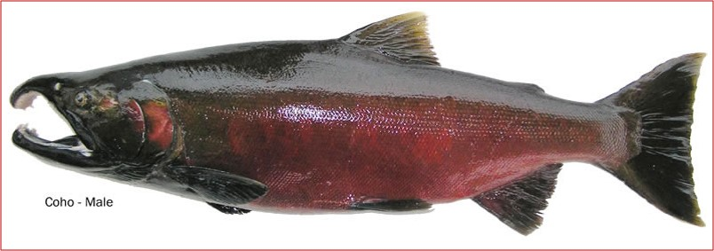

--- 
title: "Coho Periodic Report"
author: "PSC Joint Coho Technical Committee"
date: "`r Sys.Date()`"
site: bookdown::bookdown_site
output: 
  html_document:
    toc: true
    toc_float: true
header-includes:
   - \usepackage[justification=raggedright,labelfont=bf,singlelinecheck=false]{caption}  
always_allow_html: true  
documentclass: book 
bibliography: [PeriodicReport.bib]
link-citations: yes
biblio-style: apalike
description: "This is the Joint Coho Technical Committee Periodic Report"

---

#  {-}


```{r echo = FALSE}
library(openxlsx)
library(kableExtra)
library(knitr)
```
<!-- I want to add a coho pic and can't figure it out!!!   -->


```{r include=FALSE}
knitr::write_bib(c(
  .packages(), 'bookdown', 'knitr', 'rmarkdown'
), 'packages.bib')
```

