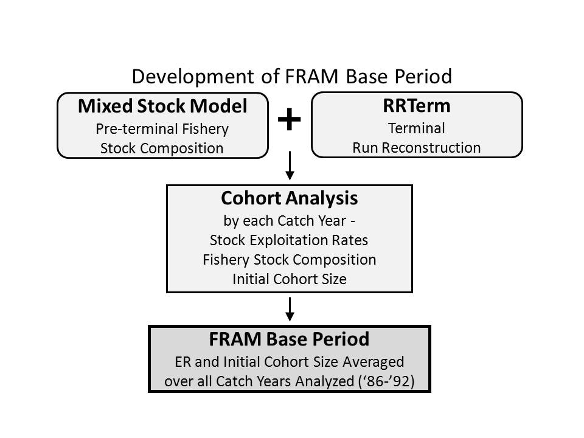

<header style="color: #ff4000; font-weight: bold; font-size: 40px; text-align:center">
    <p> !! DRAFT DOCUMENT UNDER DEVELOPMENT !! </p>
</header>

```{r setup, include=FALSE}
knitr::opts_chunk$set(echo = FALSE)

library("tidyverse")
library("readxl")
library("kableExtra")
theme_set(theme_light())

fp <- list(
  static_tables = "StaticTables.xlsx"
)

#can load an entire environment built ahead of time and save time on reknitting
load("PeriodicReport_envi.RData")
```

```{r build_envi, include=FALSE, eval=FALSE}
#### pre-declared objects in envi
members <- readxl::read_excel(fp$static_tables, sheet = "members") %>%
  mutate(across(where(is.character), ~replace_na(.,"")))

save.image("PeriodicReport_envi.RData")
```

```{r coho_pic, out.width='75%'}
knitr::include_graphics("images/CohoPic.png")
```


# Members

```{r member_table}
# #could rerun each time knitted...
# readxl::read_excel(fp$static_tables, sheet = "members") %>%
#   mutate(across(where(is.character), ~replace_na(.,""))) %>%
#   knitr::kable(caption = "Membership of the Joint Coho Technical Committee") %>%
#   kableExtra::kable_styling()

members %>%
  knitr::kable(caption = "Membership of the Joint Coho Technical Committee") %>%
  kableExtra::kable_styling()
```

# Acronyms

```{r}
#do similarly to members or if needing links can do differently...
```

# Glossary

Example of an external link like [CDFO](https://www.dfo-mpo.gc.ca/index-eng.htm).

# Executive Summary

Nothing here yet...

Example of an internal link to the section on ABM [Goals and Objectives]

# Introduction

The Pacific Salmon Commission established a Southern Coho abundance-based management regime in 1999 that set forth an agreement to constrain exploitation rates below maximum levels (caps) on selected management units (MUs of naturally-spawning Coho Salmon in southern British Columbia and Washington/Oregon). When a new Coho Agreement was reached in 2008 (implemented 2009 through 2018), modifications were made to the list of specified MUs and the manner in which exploitation rate caps are established. This periodic report only presents information for the MUs identified in the 2009 Pacific Salmon Treaty.

Chapter 5 of the 2009 Pacific Salmon Treaty Agreement (PST Agreement) between the U.S. and Canada (Parties; PSC 2009) established abundance-based management (ABM) regimes to constrain exploitation rates (ERs) on the following 13 Management Units (MUs) of naturally-spawning Coho Salmon originating in rivers along the Washington/British Columbia (B.C.) border:

```{r management_unit_table}

```

## Southern B.C. Management Units

The Canadian MUs are comprised of geographical aggregates of naturally-spawning Coho populations. The four MUs of interest to the Agreement encompass these 12 Conservation Units (CU) as determined by Canada's Wild Salmon Policy (WSP; Holtby and Ciruna 2007):

```{r sbc_mu_table}
#can fuss with formatting...

```

## U.S. Management Units

The U.S. Inside MUs consist of naturally-spawning populations originating in the Skagit, Stillaguamish, Snohomish, and Hood Canal MUs and the Strait of Juan de Fuca. Coho populations in the U.S. Inside MUs belong to the larger Puget Sound/Strait of Georgia Coho Salmon evolutionarily significant unit (ESU; Weitkamp et al. 1995). Only the eastern portion of the Strait of Juan de Fuca MU is in this ESU. An ESU is a Pacific salmon population or group of populations that is substantially reproductively isolated from other conspecific populations and represents an important component of the evolutionary legacy of the species. The ESU policy (56 FR 58612) for Pacific salmon defines the criteria for identifying a Pacific salmon population as a distinct population segment, which can be listed under the U.S. Endangered Species Act of 1973.

The U.S. Outside MUs consist of naturally-spawning populations from the Quillayute, Hoh, Queets, and Grays Harbor Basins. All U.S. Outside MUs, except the Grays Harbor MU, are part of the Olympic Peninsula ESU. Populations from the western portion of the Strait of Juan de Fuca MU are also in this ESU. The Grays Harbor MU is part of the Southwest Washington ESU.


# Coho Abundance Based Management

Under the abundance-based management (ABM) regime outlined in the 2008 PST Southern Coho Agreement, exploitation rates (ERs) (defined as total fishing mortality divided by total fishing mortality plus escapement) for each Party's fisheries are to be constrained for each MU, depending on status determinations provided by each Party.  Each year, through their domestic processes, the Parties classify the status of each MU as low, moderate, or abundant.  For the purpose of planning fisheries, the Parties exchange information pertaining to the status of their respective MUs for consideration in the development of pre-season plans.  Annual categorization of status determines the maximum ER (ER Cap) for each MU. 

## Goals and Objectives

Abundance-based management objectives are to maintain each of the MUs at Maximum Sustainable Harvest (MSH) over the long term while maintaining the genetic and ecological diversity of the component populations for the MUs. Under the Agreement, the Parties are required to establish escapement goals or ERs that achieve MSH, determine MSH ERs for each MU, and establish ERs for each MU and status category (low, moderate, and abundant).  Until such time as the Parties provide the MU ER targets, the 2008 PST Southern Coho Agreement of ABM identifies ER ceilings for the following MU status categories: 

|**Status**	|	**Total Exploitation Rate**|
|:---------:|:------------------------:|
|Low	      |	Up to 20% |
|Moderate	  |	21% - 40% |
|Abundant	  |	41% - 65% |

Details as to how exploitation rate constraints are established based on the status of MUs under the 2008 Southern Coho Agreement are contained in Annex IV Chapter 5 Section 9.b-c (Canadian exploitation rate caps on inside and outside U.S. MUs) and Section 9.d (U.S. exploitation rate caps on Canadian MUs).

## Status Dependent Exploitation Rates  

### Canadian Management Units 

Procedures for determining the pre-season status of Canadian MUs are being developed concurrently with determination of Conservation Unit (CU) status benchmarks required with implementation of the Canada Department of Fisheries and Oceans' (CDFO) Wild Salmon Policy.  Methods have been approved through the CDFO's internal peer review process, Center for Scientific Advice - Pacific (CSAP) **(Holt et al. 2009)**.  Completion of benchmark determinations for Southern B.C. Coho MUs is scheduled for CSAP review in 2014.

Since 2002, in the absence of benchmarks, the CDFO Stock Assessment staff has provided a categorical outlook for the next year's salmon status.  The [outlook](http://www.pac.dfo-mpo.gc.ca/fm-gp/species-especes/salmon-saumon/index-eng.htm) is intended to provide an objective and consistent context within which to initiate fisheries planning.  The category reflects the current interpretation of existing quantitative and qualitative information, including pre-season forecasts if available, and the opinion of CDFO Area stock assessment staff.  Where management targets for stocks have not been formally described, interim targets were either based on historical return levels or, if necessary, opinion of local staff. 

Canadian Coho Salmon abundance has declined, particularly in southern B.C.  Interior Fraser River Coho have been classified as endangered by the Committee on the Status of Endangered Wildlife in Canada (COSEWIC) since 2002, but not under the Species at Risk Act.  However, the Canadian Minister of Fisheries has established a domestic ER cap of 3% for Canadian fishery impacts on Interior Fraser Coho.  The Interior Fraser MU is comprised of five Conservation Units (CU; North Thompson, South Thompson, Lower Thompson, Fraser Canyon, and Upper Fraser).  The Interior Fraser River Coho recovery planning process has determined the critical benchmark needed to maintain population viability.  Even with the reduction in fisheries exploitation, all Southern B.C. MUs have followed a similar dramatic declining trend in both marine survival and total abundance from the high levels observed in the 1980s and early 1990s **(Figure 4.1)**.  Spawning escapements have responded to the decreased exploitation and are within the range observed during the 1970s and 1980s.  However, the sustained low marine survival has resulted in a decreased total abundance. 

*move to section 3?*
Because of the absence of programs to estimate total abundance and escapement for many Canadian MUs, the bilaterally-developed tool, Backwards Coho FRAM, is relied upon to generate estimates of ocean age-3 cohort abundance and ERs using post-season data.  Cohort abundances (catch and escapement) of Canadian MUs, estimated by Backwards Coho FRAM, are depicted in Figure \@ref(fig:BCAbundance).  Reduced abundances apparent since 1996 were a major consideration that led to the development of ABM regimes for management of southern Coho Salmon.

```{r BCAbundance, echo = FALSE, fig.cap = "Estimated Ocean Age-3 Abundances of Southern B.C. Coho Salmon Management Units; Catch Years 1986-2018.", eval=FALSE}
PrePostBC <- openxlsx::read.xlsx("./data/CoTc_Output_File.xlsx", sheet = 3, detectDates = FALSE)

PrePostBC <- tidyr::separate(PrePostBC[,-1], 3, c("Abundance", "Status"), sep = " ")

PrePostBC <- tidyr::separate(PrePostBC, 5, c("Abundance2", "Status2"), sep = " ")

ggplot(PrePostBC, # this is where the dataframe goes
                aes(x = as.numeric(Catch.Year),  # X axis column name
          y = as.numeric(Abundance2)/1000, # need to make sure that Y axis data is numeric, AND we are dividing by 1000 for the axis
          group = Management.Unit)) + # grouping by Management unit so that the legend groups the colours and linetypes later
  theme_classic() +
          geom_line(aes(colour = Management.Unit, # choosing to make each Management Unit a different Colour
          linetype = Management.Unit),  # making each MU a different linetype
          size = 1.25) + # making the lines thicker (>1) (or thinner by going < 1)
      scale_linetype_manual(values = c("solid", "longdash", "twodash", "dotted")) + # changes the line types
      scale_color_manual(values = c('#abd9e9','#2c7bb6', '#fdae61', '#d7191c')) + # used colorbrewer2.org to select colour codes
      labs(x = "Catch Year", y = "Cohort Abundance (thousands)") # renaming the x and y axis
```

### U.S. Management Units

#### U.S. Inside Management Units

The status for U.S. Inside MUs is assigned based on ocean abundance (forecasted or re-constructed).  Pre-season estimates of ocean abundance are typically forecasted from measured or modeled smolt production for each MU and multiplied by a marine survival rate predicted for each MU.  Marine survival is predicted with a variety of methods including average return rates, correlations between jack and adult return rates, and correlations between environmental variables and historical return rates.  Post-season estimates of ocean abundance are estimated using escapement and catch data and the Backwards Coho FRAM.  The status of each MU is defined by a series of ocean abundance breakpoints (see Table: \@ref(tab:InsideMUABM)).  Domestic management of Puget Sound naturally-spawning Coho stocks also uses abundance-based, tiered ER objectives defined in the Comprehensive Coho Plan **(CCW 1998)**, that are similar to but not exactly consistent with the PSC guidelines.  The identified break points between Low, Moderate, and Abundant status are based on population-specific productivity analyses conducted by the state and tribal co-managers in each river basin.

```{r InsideMUABM, echo = FALSE, eval=FALSE}
table4.1 <- openxlsx::read.xlsx("./data/CoTc_Output_File.xlsx", sheet = 1, detectDates = FALSE)
names(table4.1) <- gsub(x = names(table4.1),
                        pattern = "\\.",
                        replacement = " ")

knitr::kable(
  table4.1[,-1], 
  caption = "Abundance Category Breakpoints in Ocean Age-3 Abundance Associated with Low, Moderate, and Abundant Status of Naturally-Spawning Coho, U.S. Inside Management Units (PFMC 2012).", format.args = list(big.mark = ",")
)
```

#### U.S. Outside Management Units

The status for U.S. Outside MUs is assigned based on the ER ceiling identified annually, ocean abundance, and existing MU escapement goals.  Pre- and post-season ocean abundances are estimated with the same approach described for the U.S. Inside MUs.  Escapement goals for the U.S. Outside MUs are defined by state and tribal co-managers in each river basin and include escapement ranges in all but one (Grays Harbor) MU.  Escapement ranges were originally intended to reflect the range of uncertainty in the MSH escapement goals identified for each of these populations.  Unlike the U.S. Inside MUs, escapement goals for the U.S. Outside MUs do not vary with run size.  The escapement goals used for PST status determinations are the floor of the designated escapement ranges (see Table: \@ref(tab:OutsideMUABM)).  The stock status is "Low" if the ocean abundance is low enough that the ER ceiling falls at or below 20% in order to achieve the bottom end of the escapement range.  The stock status is "Moderate" if ocean abundance results in an ER ceiling between 21% and 40%.  The stock status is "Abundant" if ocean abundance results in an ER ceiling above 41%.

```{r OutsideMUABM, echo=FALSE, eval=FALSE}
table4.2 <- openxlsx::read.xlsx("./data/CoTc_Output_File.xlsx", sheet = 2, detectDates = FALSE)
names(table4.2) <- gsub(x = names(table4.2),
                        pattern = "\\.",
                        replacement = " ")

knitr::kable(
  table4.2[,-1], 
  caption = "Abundance Category Breakpoints in Ocean Abundance (harvest + escapement) Associated with Low, Moderate, and Abundant status of Naturally-Spawning Coho, Outside U.S. Management Units.", format.args = list(big.mark = ",")
)
```

U.S. MUs belong to three different Coho Salmon evolutionarily significant units (ESU), the Puget Sound/Strait of Georgia, the Olympic Peninsula, and the Southwest Washington ESUs.  The Puget Sound/Strait of Georgia Coho ESU is currently a species of concern under the U.S. Endangered Species Act **(ESA; NMFS 2009)**.  The Olympic Peninsula ESU was evaluated for listing under the ESA and it was determined to be not warranted **(Weitkamp et al. 1995)**.  The Southwest Washington ESU is currently categorized as "undetermined".  The State of Washington considers Coho Salmon statewide to be a State Candidate to be reviewed for possible state listing as Endangered, Threatened, or Sensitive **(WDFW 2008)**.

At the federal level, species of concern do not have formal protection under the ESA.  The primary purpose of identifying species of concern is to prevent the need to list them as threatened or endangered under the ESA.  This purpose can be achieved by the following actions: (1) identifying species potentially at risk; (2) increasing public awareness about those species; (3) identifying data deficiencies and uncertainties in species' status and threats; (4) stimulating cooperative research efforts to obtain the information necessary to evaluate species' status and threats; and, (5) fostering voluntary efforts to conserve the species before listing becomes warranted.

Estimated ocean age-3 cohort abundances for Inside and Outside U.S. MUs are depicted in **Figure 4.2** and **Figure 4.3**, respectively.  Abundances for inside MUs tend to be synchronous, with above- or below-average abundances occurring in the same years (e.g., high in 2001, low in 2006).  Outside MUs are less synchronous and years with high abundances for Grays Harbor don't necessarily correspond to high abundances for other MUs.  
*need to fix figures 4.2 and 4.3 and add them here*

<center> __Estimated Ocean Age-3 Abundances of U.S. Inside Coho Salmon Management Units; Catch Years 1986-??.__ </center>

<center> __Estimated Ocean Age-3 Abundances of U.S. Outside Coho Salmon Management Units; Catch Years 1986-??.__ </center>


## Annual Determinations of Allowable Exploitation Rates for Management Units

## Constraints on Exploitation Rates by Intercepting Fisheries

## Information Requirement for Implementation

### Stock and Fishery Assessment Reporting Systems

# Bilateral Assessment Tool - FRAM 

[FRAM Overview](https://framverse.github.io/fram_doc/index.html)

[Coho FRAM model details](https://framverse.github.io/fram_doc/calcs_data_coho.html)

[Coho FRAM pre- and post-season applications](https://framverse.github.io/fram_doc/apps_coho.html)

Coho fisheries are evaluated with the Coho Fisheries Regulation Assessment Model (Coho FRAM), a bilaterally developed tool that is employed for both pre-season fishery planning and post-season estimation of escapements and exploitation rates.  In simplest terms the Coho FRAM is an accounting model that evaluates X stocks in Y fisheries over Z time periods.  It can be used to estimate catch and escapement based on forecast abundance and planned fisheries (forward FRAM) or it can be used to reconstruct ocean abundance from observed escapements and fisheries (backward FRAM). The model is founded on a Base Period (currently 1986 to 1992) and scales it according to current stock abundances and fisheries impacts.  The base period is constructed with the aid of two other companion programs, the Mixed Stock Model (MSM) and RRTERM (Terminal Area Run Reconstructions). 

## FRAM Base Period

The base period is constructed from stock-specific ocean distributions by fishery and time period (January to June, July, August, September, and October to December) developed from coded-wire-tag (CWT) recoveries in coast wide fisheries from  1986 to 1992. The procedure used to generate base period data is depicted [below](#fig:FRAMDevel).  For each base period year, post-season reconstruction of cohort abundances for each Coho MU is based on two different models: the Mixed-Stock Model (MSM) that estimates the Production Expansion Factors for each Production Region and RRTERM program that estimates stock-specific impacts for terminal marine and freshwater fisheries.  The MSM uses CWT recoveries for each model stock expanded by the Production Expansion Factors to best describe the total catch in each marine mixed-stock fishery. The MSM/RRTERM cohort analysis has been used for post-season reconstructions for catch years **1986-??**.  The base period annual exploitation rates by fishery-month strata are provided in **here**.  Because escapement estimates were not available for several Canadian MUs for these years, escapement for Canadian MUs (excluding Interior Fraser) was estimated as catch*(1-ER), where ER was the hatchery indicator exploitation rate.

<div id="fig:FRAMDevel">

</div>

### Selection and Use of Coded-Wire Tags

### Mixed-Stock Model and RRTERM

## Coded-Wire-Tag Indicator Stocks{CWTProgram}

**should this be in its own chapter (like it was in the previous report?)**

<!-- <span style="font-variant:small-caps;">Small Caps</span> -->

The coded-wire tag (CWT) indicator stock program provides the primary data for predicting, monitoring, and modeling harvest impacts on individual Coho Salmon populations.  The Joint Coho Technical Committee (CoTC) uses CWT recoveries from the indicator stocks to reconstruct cohorts coastwide.  While a few indicator tag groups are naturally-spawning fish, the vast majority consist of hatchery fish intended to represent each MU.  Hatchery indicator stocks are selected on the basis of brood stock, rearing, and release strategies and are assumed to be surrogates for the naturally-spawning fish.  The indicator program assumes that tagged and untagged fish experience similar trends in marine survival and similar exploitation patterns.  Coastwide, approximately eight million juvenile Coho Salmon are coded-wire tagged annually **(Nandor et al. 2010)**.

Some major changes in the CWT indicator stock program have occurred since the Pacific Salmon Treaty was signed in 1985.  One of the most notable changes is the mass marking of hatchery fish in the Pacific Northwest.  For many years, an adipose fin clip was used as an external mark to identify fish (natural spawning or hatchery) with a CWT.  However, since brood year 1995 in the U.S. and 1996 in Canada, the adipose fin clip has been used as a mass mark to identify hatchery-origin fish and no longer uniquely indicates a coded-wire-tagged fish.  With the advent of mark-selective fishing, marked (adipose fin-clipped) and unmarked fish do not have the same patterns of exploitation, violating the fundamental assumption of the indicator tag program.  These changes in marking and fishing have resulted in the development and use of double index tag (DIT) releases in the indicator tag programs. The DIT group consists of two groups of hatchery fish, each 100% tagged with its own unique CWT.  The two groups are presumed to be identical, except that one tagged group is unmarked and the other group is marked with an adipose fin clip.  In a MSF, catches of marked fish will be retained whereas catches of unmarked fish will be released.  The difference in return rates to the hatchery reflects the difference in ocean ERs in selective fisheries.  A DIT group is recommended when the stock of interest is expected to be exploited by a mark-selective fishery (MSF).  Unpaired (non-DIT) tag groups are either marked or unmarked and are considered single index tag (SIT) groups in this document. 

To obtain unbiased estimates of fishery-specific impacts on individual stocks, a known proportion of both the catch and escapement must be sampled for CWTs throughout the migratory range of the stock and the proportion sampled must be adequate to produce a statistically reliable expansion of sampled Coho.  Mass marking creates the following two additional complexities for sampling of CWTs: (1) DIT stocks are unmarked but contain CWTs; and (2) marked fish do not necessarily contain CWTs.  Therefore, all fish, not just marked fish (with an adipose fin-clip), must be sampled for CWTs.  Detection of CWTs in unmarked fish requires electronic sampling using wands or tubes. Detection of CWTs in marked fish requires either field-based electronic sampling or collection of snouts for processing in the laboratory.  For complete accounting, fish must be sampled throughout their range, in catch and escapement. Electronic sampling of both unmarked and marked Coho places an additional burden of time and expense on agencies 

At present, the utility of the DIT program and the CWT program in general for Coho is reduced due to low tagging rates, insufficient MU representation, low recovery rates, and incomplete coastwide coverage of electronic sampling programs **(PSC-CWTW 2008)**.  In addition, the CWT program: (1) currently provides overall differences in ocean ERs – can’t discriminate individual fisheries; (2) has sample sizes that are generally small, so confidence limits are wide and estimates of differential impacts are imprecise; (3) is expensive and agencies are reluctant to fund tagging programs; and (4) unmarked DIT fish are unavailable for harvest in MSFs.

Most MUs in the U.S. have CWT indicator stocks and DIT programs.  However, some of the programs have been eliminated in recent years due to budgetary constraints.  **Canada has  discontinued all of their DIT programs**.  The current Coho CWT indicator stocks for each MU and the brood years with DIT groups are listed in **Table 3.1**.  The tag codes used to represent each MU in the MSM for catch years 1986-1997 are listed in **Appendix B**.  All DIT groups released to date for each MU are listed in **Appendix C**. 

*Need to update this table!* 

**CWT indicator stocks and brood years with single index tag (SIT) and double index tag (DIT) groups for each Coho Management Unit (MU), brood years 1983-year.  Indicator stocks are hatchery-produced Coho unless specified as “Wild” (RMISD 2011).  SIT groups may be either marked or unmarked releases of CWT Coho.  DIT groups are marked and unmarked pairs of CWT Coho.**

|Management Unit |	Indicator Stock |	Brood Yr </br> SIT | Brood Yr </br> DIT |
|------------------ | :-----------------| :------: | :------:|
| Southern B.C. MUs	||||
|	Lower Fraser |	Inch Creek Hatchery	| 83-95	| 96-08 |
||	Salmon River (Wild)[^1] |	84-01,05-07 |	NA |
||	Chilliwack R. Hatchery |	83-95 |	96-02 |
|	Interior Fraser |	Spius Cr. Hatchery (Coldwater R.)[^2] |	84-94,96-98 |	99-02 |
||	Spius Cr. Hatchery (Salmon R.)[^3] |	95-96,99,01-02,04-05,07 |	--|
||	Spius Cr. Hatchery (Spius Cr.)|	94-96,99-00 |	97-98|
||	Eagle R. Hatchery (Salmon R.)	| 83-93	| --|
||	Eagle R. Hatchery (Eagle River)|	83-93	| --|
||	Dunn Cr. Hatchery  (Dunn Cr.)[^4]	| 83-92,94-95,97-07	| --|
||	Dunn Cr. Hatchery (Lemieux Cr.)[^5]	| 83-86,88-95,97-08	| --|
||	Dunn Cr. Hatchery (Louis Cr.)[^6] |	88-94,97-07	| --|
||	Eagle River (Wild)[^7] | 00-03	| NA |
||	Lemieux Creek (Wild) | 92-93 |	NA |
|	Strait of Georgia Mainland	| Capilano River Hatchery |	83-97,00 |	-- |
||		Lang Creek Hatchery|	07-08	| -- |
|	Strait of Georgia Vancouver Island |	Quinsam River |	83-95	96-08|
||		Big Qualicum River Hatchery|	83-85,87-95,03-08	| 96-02 |
||		Goldstream River Hatchery	|91-94,03-08	|96-02|
||		Puntledge River Hatchery[^8] |	83-02	| -- |
||		Black Creek (Wild)[^9] |	83-07	| NA |
| U.S. Inside MUs	||||
|	Skagit|	Marblemount Hatchery (Skagit)[^10] |	83-94, 99-02 |	95-08 |
||	Baker River (Wild)[^11] | 	83-08	| NA |
|	Stillaguamish[^12] |	Wallace River H. (Skykomish)|	83-95 |	96-08 |
||		Bernie Gobin Hatchery [^13] |	83-08|	--|
||		Stillaguamish (Wild)|	84-87	| NA |
|	Snohomish	|Wallace River H. (Skykomish) |	83-95 |	96-08 |
||		Bernie Gobin Hatchery|	83-08 |	-- |
|Hood Canal|	Quilcene NFH |	87-95 |	96-07 |
||	Quilcene Bay Sea Pens |	88,90,93,95,02-08 |	96-01|
||	Port Gamble Bay Pens |	83-96,04-08	| 96-03|
||	George Adams Hatchery	| 83-94,96|	95,97-08|
||	Big Beef Creek (Wild)[^14] |	83-08 |	NA |
|Strait of Juan de Fuca	 | Lower Elwha Hatchery	| 86,90-94,98-03 |	95-08|
||	Dungeness Hatchery[^15] |	83,86,89,91-94,05-08 |	--|
||	Hoko and Salmon Cr. (Wild) |	84-87,08 |	NA|
|U.S. Outside MUs ||||
|Quillayute	| Sol Duc Hatchery[^16]|	83-88,90-95,00,03-04 |	96-99,01-03,05-06 |
||	Various Tributaries (Wild)[^17] | 	83-86,88-92,07-08 |	07-08 |
|Hoh |	Chalaat Creek Hatchery |	84,86-89 |	-- |
||	Canyon Springs Pond	| 86-87	| -- |
||	Sol Duc Hatchery |	85,87 |	-- |
||	Hoh River (Wild)[^18] | 	83-87,03-06	| NA |
|Queets |	Quinault Lake Hatchery	| 83-84,90-92 |	-- |
||	Salmon R. Fish Culture[^19] |	83-04,06 |	95-03,05,07-08 |
||	Queets/Clearwater wild[^20] |	83-08 |	NA |
|Grays Harbor |	Bingham Creek Hatchery[^21] |	83-94 |	95-08 |
||	Aberdeen Net Pens	| 88-90,92 |	-- |
||	Humptulips Hatchery	| 83-94,06 |	95-96 |
||	Bingham Creek (Wild)[^22] |	83-08 |	NA |
||	Stevens & Scatter Creek (Wild) |	83-90,92-93	 | NA |
||		Chehalis Upriver (Wild)[^23] |	83-97,00-08	| NA |

[^1]: Brood years 1996-2001 and 2005-07: all tagged releases were unmarked. 
[^2]: Brood years 1997 and 1998: all tagged releases were unmarked.
[^3]: Brood years 1999, 2001-02, and 2005: all tagged releases were unmarked.
[^4]: Beginning BY 1997, all tagged releases were unmarked. 
[^5]: Beginning BY 1997, all tagged releases were unmarked. 
[^6]: Beginning BY 1997, all tagged releases were unmarked. 
[^7]: All tagged releases were unmarked.
[^8]: For BYs 1997 and 1999-2000, unmarked CWT fish were released, but not associated with a DIT group in RMIS.
[^9]: Brood years 1997-2000, 2002-03, and 2005-07: all tagged releases were unmarked.  Brood year 2001 unmarked CWT fish were also released, but not associated with a DIT group in RMIS.
[^10]: Brood year 2004 unmarked CWT fish were also released, but not associated with a DIT group in RMIS.
[^11]: Beginning BY 1996, all tagged releases were unmarked.
[^12]: Bernie Gobin Hatchery tagging program and the Skykomish tagging program at the Wallace River Hatchery are used to represent production in both the Stillaguamish and Snohomish River Basins.
[^13]: Brood years 1997 and 1998: all tagged releases were unmarked.
[^14]: Beginning BY 1996, all tagged releases were unmarked
[^15]: Brood year 2005: unmarked CWT fish were released, but not listed as an associated DIT group in RMIS.
[^16]: Brood years 2000 and 2004: unmarked CWT fish were released, but not listed as an associated DIT group in RMIS. 
[^17]: Release groups were very small except Solduc BYs 07-08. 
[^18]: In all years, release groups are very small.  Brood years 03-06: tagged releases were unmarked.
[^19]: Brood years 2004 and 2006: unmarked CWT fish were released, but not listed as an associated DIT group in RMIS.
[^20]: Beginning BY 1996, all tagged releases were unmarked.
[^21]: Brood years 95, 04, 06-08 are listed as “Satsop” stock of a “mixed” origin in RMIS.
[^22]: Beginning BY 1995, all tagged releases were unmarked.
[^23]: Brood years 1995-1997 and 2000-2008: tagged releases were unmarked.


# Annual Implementation

# Fishery Information

# Management Units

# Appendices

## Appendix A

## Appendix B

## Appendix C

