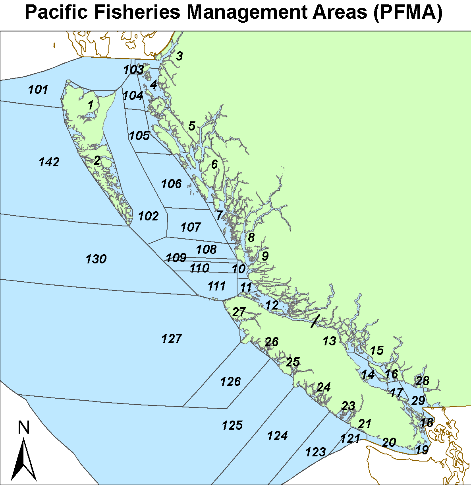

<header style="color: #ff4000; font-weight: bold; font-size: 40px; text-align:center">

<p>

!! DRAFT DOCUMENT UNDER DEVELOPMENT !!

</p>

</header>


```{r setup, include=FALSE}
knitr::opts_chunk$set(echo = FALSE, warning = FALSE, message = FALSE)

library("tidyverse")
library("readxl")
library("kableExtra")
library("gt")
theme_set(theme_light())

# #can load an entire environment built ahead of time and save time on reknitting
# load("PeriodicReport_envi.RData")

#but to deal with WA Coast stocks from TAMM spreadsheets, among other reasons
psc <- readr::read_csv("psc_postfram_1998_2021.csv")

static <- list(
  members = readxl::read_excel(params$static_tables, sheet = "members") |> 
    mutate(across(where(is.character), ~replace_na(.,"")))
  ,
  acronyms = readxl::read_excel(params$static_tables, sheet = "acronyms") |> 
    mutate(across(where(is.character), ~replace_na(.,"")))
  ,
  #modified from: https://github.com/dappdrd/CohoPSC/blob/bb61dd39715a29a739259c3791cdd26bd8f42a2f/server.R#L65
  #another place with LU info is the "year_template" sheet of the annual escapement compilation 
  lu_stock = readxl::read_excel(params$static_tables, sheet = "lu_stock") |> 
    mutate(across(where(is.character), ~replace_na(.,"")))
  ,
  glossary = readxl::read_excel(params$static_tables, sheet = "glossary") |> 
    mutate(across(where(is.character), ~replace_na(.,"")))
)

```

```{r rebuild_psc_csv, include=FALSE, eval=FALSE}
#mdb from params arg above, sourced locally from CoTC Sharepoint
#moving from .RData to .csv on load to allow more portability/generality

fram_mdb_reader <- function(
    mdb_file_path = params$mdb,
    fram_table,
    osx = grepl("apple", sessionInfo()$platform)
    ) {
  if(osx){
    t_out <- readr::read_csv(I(
      system2(
        "mdb-export",
        args = paste(str_replace_all(mdb_file_path, " ", "\\\\ "),
                     fram_table),
        stdout = T) 
    ))
  } else {
    db_con <- DBI::dbConnect(
      drv = odbc::odbc(),
      .connection_string = paste0(
        "Driver={Microsoft Access Driver (*.mdb, *.accdb)};DBQ=", mdb_file_path, ";")
      )

    t_out <- DBI::dbReadTable(db_con, fram_table)

    DBI::dbDisconnect(db_con)
  }
  return(t_out)
}


fram <- list()

fram$stockIDs <- static$lu_stock$StockID

fram$runIDs <- 22:45 #1998-2020, but 34:44 2010onward

#Note the original negative escapement in A12A Wild in 2005 is due to an error in the FRAM database
#Mortality is summed across timesteps (and Ages, but only 3s anyway)
#maintaining FRAM stocks and fisheries
fram$fishery <- fram_mdb_reader(fram_table = "Fishery") |> 
  filter(Species == "COHO") |> select(FisheryID, FisheryName)
fram$stock <- fram_mdb_reader(fram_table = "Stock") |> 
  filter(Species == "COHO", StockID %in% fram$stockIDs) |> select(StockID, StockLongName)
fram$runid <- fram_mdb_reader(fram_table = "RunID") |> 
  filter(RunID %in% fram$runIDs) |> 
  select(RunID, RunYear)
fram$escp <- fram_mdb_reader(fram_table = "Escapement") |> 
  filter(StockID %in% fram$stockIDs, RunID %in% fram$runIDs) |> 
  select(RunID, StockID, escp = Escapement) |> 
  mutate(escp = if_else(escp < 0, 0, escp))
fram$mort <- fram_mdb_reader(fram_table = "Mortality") |> 
  filter(StockID %in% fram$stockIDs, RunID %in% fram$runIDs) |> 
  mutate(
    mort_ns = LandedCatch + NonRetention + Shaker + DropOff,
    mort_msf = MSFLandedCatch + MSFNonRetention + MSFShaker + MSFDropOff,
    mort = mort_ns + mort_msf
  ) |> 
  group_by(RunID, StockID, FisheryID) |> 
  summarise(across(LandedCatch:mort, ~sum(., na.rm=T)), .groups = "drop")


# #build out the yearly totals and ER info for PSC stock (and fishery?) aggregations
# #SUS fisheries are FRAM FisheryID 1:166
# #Canadian are FRAM FisheryID 167:193
# #AK are 193:max?

# join PSC metadata and re-aggregate, 
# also adding columns of total mortality per year per re-aggregated PSC stock 
# these are summed over fisheries and repeating per individual fishery
# same idea for escapement...

psc <- left_join(
  fram$mort |> 
    left_join(fram$runid, by = "RunID") |> 
    left_join(fram$fishery, by = "FisheryID") |> 
    left_join(
      static$lu_stock |> 
        select(StockID, PSC_StockID, PSC_StockName),
      by = "StockID") |> 
    group_by(RunYear, PSC_StockID, PSC_StockName, FisheryID, FisheryName) |> 
    summarise(across(starts_with("mort"), sum), .groups = "drop") |> 
    group_by(RunYear, PSC_StockID, PSC_StockName) |> 
    mutate(across(starts_with("mort"), list(sum = sum), .names = "{.col}_{.fn}")) |> 
    ungroup()
  ,
  fram$escp |> 
    left_join(fram$runid, by = "RunID") |> 
    left_join(
      static$lu_stock |> 
        select(StockID, PSC_StockID, PSC_StockName),
      by = "StockID") |> 
    group_by(RunYear, PSC_StockID, PSC_StockName) |> 
    summarise(across(escp, sum), .groups = "drop") 
  ,
  by = c("RunYear", "PSC_StockID", "PSC_StockName")
  ) |>
  mutate(
    abund = mort_sum + escp,
    across(c(mort, mort_sum), list(er = ~.x/abund))
  ) |> 
  left_join(
    static$lu_stock |> 
      distinct(PSC_StockID, PSC_Region, cap_method,
               low_mod_abund, mod_abd_abund,
               low_er_cap, mod_er_cap, abd_er_cap,
               low_escp_goal, upr_escp_goal)
    , by = "PSC_StockID"
    )

##Quillayute and Queets post-season values are drawn from TAMM
#https://github.com/PSC-CoTC/AnnualReport/blob/master/csv/TammFisheryQueetsRef.csv
#need to swap out some fishery values (and escp for Quil?)
#sheet 2, r48, col26 Quil escp (2021: 9907)
#sheet 2, r38, col26 Quil TR net, fid 71 (2021: 1083)
#sheet 2, r39, col26 Quil spt, fid 70 (2021: 174)
#plus 0 fid72 for sid131, 70:72 for sid132

#sheet 2, r48, col31 Queets escp (2021: 4530)
#sheet 2, r38, col31 Queets TR net, fid 68 (2021: 164)
#sheet 2, r39, col31 Queets spt, fid 65 (2021: 56)
#plus 0 out 66,67,69 for sid 139 and 65:69 for sid140 (prob already 0)


# rm(params, static, fram, fram_mdb_reader)
# save.image("PeriodicReport_envi.RData")

write_csv(psc, "psc_postfram_1998_2021.csv")

```

*Note that Quillayute and Queets values are those from the FRAM database and have not yet been extracted from the relevant TAMM cells for each year*

```{r func_plot_abund_bar}
plot_abund_bar <- function(stknm = "Skagit"){
  psc |> 
    filter(PSC_StockName==stknm, RunYear > 2003) |>
    distinct(RunYear, PSC_StockName, 
             Harvest = mort_sum, Escapement = escp, Abundance = abund, 
             low_mod_abund, mod_abd_abund) |> 
    pivot_longer(names_to = "var", values_to = "val",
                 -c(RunYear, PSC_StockName, low_mod_abund, mod_abd_abund)) |> 
    mutate(across(ends_with("_abund"), ~if_else(var == "Abundance", ., NA_real_))) |> 
    ggplot(aes(RunYear, val, fill = var, color = var)) + 
    geom_col(width = 0.7) + 
    geom_hline(aes(yintercept = low_mod_abund), color = "orange", linetype = 5, linewidth = 1.2) +
    geom_hline(aes(yintercept = mod_abd_abund), color = "orange", linetype = 5) +
    geom_vline(xintercept = 2010, linetype = 3, alpha = 0.5) +
    geom_smooth(formula = y ~ x, method = "lm", se = F, linewidth = 0.5, linetype = 2) +
    scale_fill_grey("", start = 0.3, end = 0.7, aesthetics = c("fill", "color")) +
    scale_x_continuous(breaks = seq(1998, 2040, by = 3), guide = guide_axis(n.dodge = 2)) +
    scale_y_continuous("", labels = scales::comma) +
    facet_wrap(~var, nrow = 1) +
    theme(legend.position = "none") +
    labs(subtitle = stknm)
}

#plot_abund_bar()
```

```{r func_plot_ns_msf}
plot_ns_msf <- function(stknm = "Skagit"){
  psc |> 
    filter(PSC_StockName==stknm) |> 
    distinct(RunYear, PSC_StockName, NS = mort_ns_sum, MSF = mort_msf_sum) |> 
    pivot_longer(names_to = "var", values_to = "val", -c(RunYear, PSC_StockName)) |> 
    ggplot(aes(RunYear, val, fill = var)) +
    geom_col(width = 0.7, show.legend = F) +
    scale_fill_grey() +
    scale_x_continuous(breaks = seq(1998, 2040, by = 3), guide = guide_axis(n.dodge = 2)) +
    scale_y_continuous("Mortality", labels = scales::comma) +
    facet_wrap(~var, nrow = 1) +
    labs(subtitle = stknm)
}

```


This report based on `r basename(params$mdb)`

```{r coho_pic, out.width='75%'}
knitr::include_graphics("images/CohoPic.png")
```

# Introduction

In response to a decline in natural coho abundance, the Pacific Salmon Commission established a Southern Coho abundance-based management regime (CoABM) in 1999 (PSC 1999). This Southern Coho Management Plan (SCMP, also referred to as ABM, or 'abundance based management') aimed to conserve Coho Management Units (MUs of naturally-spawning Coho Salmon in southern British Columbia and Washington/Oregon) based on abundance status and escapement goals. The SCMP set out to constrain exploitation rates (ERs; defined as total fishing mortality divided by total fishing mortality plus escapement) below maximum levels (caps) on selected management units in order to achieve long-term Maximum Sustainable Harvests (MSH). These constraints are implemented by specifying ER caps for the individual MUs dependent on annual abundance status. During their respective preseason planning processes, the Parties use management reference points to classify the status of each MU as low, moderate, or abundant. The parties then exchange these status determinations as a key factor in development of pre-season plans.

When a new Coho Management Plan was reached in 2008 (implemented 2009 through 2018; PSC 2009) and the latest agreement finalized (applies to the period from 2019 through 2028; PSC 2022), modifications were made to the list of specified MUs and to the manner in which exploitation rate caps are established. This periodic report presents information for the MUs identified in the most current Pacific Salmon Treaty's (PST) Southern Coho Management Plan (Chapter 5 of Annex IV in the current PST). In the 2008 SCMP abundance-based management regimes were established to constrain exploitation rates (ERs) on the 13 Management Units (MUs) of naturally-spawning Coho Salmon originating in rivers along the Washington/British Columbia (B.C.) border listed below. Within the most recent Management Plan (PSC 2022), the Georgia Strait Vancouver Island and the Georgia Strait Mainland Management Units are now combined into the Strait of Georgia Management Unit. 

The objective of the SCMP, as described in the Treaty, is to manage the fisheries impact on Southern coho stocks by limiting the total fishery exploitation and allow the different MUs to produce long-term Maximum Sustainable Harvest (MSH), while maintaining the genetic and ecological diversity of the individual populations. In addition, the plan is designed to improve the prospect of sustaining healthy fisheries for both parties over the long-term. The plan is intended to be cost-effective and flexible to available technical capacity and information, while providing a predictable framework for planning fisheries impacts and allowing for objective monitoring, evaluation and modification.

Under the Agreement, the Parties are required to establish escapement goals or ERs that achieve MSH, determine MSH ERs for each MU, and establish ERs for each MU and status category (low, moderate, and abundant). Until such time as the Parties provide MU-specific ER targets, the SCMP identified default ER ceilings for the following MU status categories:

| **Status** | **Total Exploitation Rate** |
|:----------:|:---------------------------:|
|    Low     |          Up to 20%          |
|  Moderate  |          21% - 40%          |
|  Abundant  |          41% - 65%          |

Annual ER caps are established for each of the MUs based on the level of abundance and health of the natural stocks. These caps are then apportioned between the Parties. Constraints for Canadian fisheries on U.S. MUs are determined by formulas that specify sharing of allowable ERs as well as a composite rule, which together adjust caps according to the number of U.S. MUs that fall within a given category. Constraints for U.S. fisheries on Canadian MUs depend on the status of the Interior Fraser MU until the biological status of the other Canadian MUs has been determined. Canada is currently working to develop the information (smolt to adult survival rates, escapements) needed to apply the status determination method used for the Interior Fraser coho MU to the Lower Fraser and Strait of Georgia MUs. Details as to how exploitation rate constraints are established based on the status of MUs under the SCMP are contained in Annex IV Chapter 5 Section 9.b-c (Canadian exploitation rate caps on inside and outside U.S. MUs) and Section 9.d (U.S. exploitation rate caps on Canadian MUs).

## Management Unit Overview

The Canadian MUs are comprised of geographical aggregates of naturally-spawning Coho populations.

The U.S. Inside MUs consist of naturally-spawning populations originating in the Skagit, Stillaguamish, Snohomish, Hood Canal and the Strait of Juan de Fuca. Coho populations in the U.S. Inside MUs belong to the larger Puget Sound/Strait of Georgia Coho Salmon evolutionarily significant unit (ESU; Weitkamp et al. 1995). Only the eastern portion of the Strait of Juan de Fuca MU is in this ESU. An ESU is a Pacific salmon population or group of populations that is substantially reproductively isolated from other conspecific populations and represents an important component of the evolutionary legacy of the species. The ESU policy (56 FR 58612) for Pacific salmon defines the criteria for identifying a Pacific salmon population as a distinct population segment, which can be listed under the U.S. Endangered Species Act of 1973.

The U.S. Outside MUs consist of naturally-spawning populations from the Quillayute, Hoh, Queets, and Grays Harbor Basins. All U.S. Outside MUs, except the Grays Harbor MU, are part of the Olympic Peninsula ESU. Populations from the western portion of the Strait of Juan de Fuca MU are also in this ESU. The Grays Harbor MU is part of the Southwest Washington ESU.

```{r mu_table}
# psc |> 
#   distinct(Region = PSC_Region, `Management Units` =  PSC_StockName) |> 
#   arrange(Region) |>  
#   mutate(Region = str_replace(Region, "Canada", "Southern B.C.")) |> 
#   gt(groupname_col = "Region") |> 
#   tab_options(table.width = px(250)) |> 
#   tab_style(locations = cells_column_labels(), style = cell_text(align = "center")) |> 
#   tab_style(locations = cells_row_groups(), style = cell_text(align = "left", weight = "bold")) |> 
#   tab_style(locations = cells_body(), style = cell_text(align = "right"))

tibble(
  `Southern BC` = c("Interior Fraser", "Lower Fraser", "Strait of Georgia", "", ""),
  `US Outside` = c("Skagit", "Stillaguamish", "Snohomish", "Hood Canal", "US Strait JDF"),
  `US Inside` = c("Quillayute", "Hoh", "Queets", "Grays Harbor", "")
) |> 
  gt() |> 
  tab_options(table.width = px(400)) |> 
  tab_style(locations = cells_column_labels(), style = cell_text(align = "center", weight = "bold")) |> 
  tab_style(locations = cells_body(), style = cell_text(align = "left")) |> 
  tab_header(title = "Management Units")

```

## Fishery Overview

Under the CoABM regime, each Party is required to regulate its fisheries so as not to exceed exploitation rate (ER) constraints on MUs. Fisheries and changes in management objectives during the reporting period are summarized within this chapter. Total fishery mortality of all Management Units combined, by Canada and the U.S. from 1986 to 2021 is depicted in **Figure 5.1**. Here are maps showing Fishery Management Areas for British Columbia, Washington, and Oregon:




### Canadian Fisheries

Southern B.C. Coho Salmon are caught in First Nations, recreational, and commercial troll and net fisheries. Since Coho Salmon rear in areas near the coast they are readily caught in directed fisheries and as bycatch in fisheries targeting other species. As a result, Coho are harvested in mixed-stock fisheries, creating many challenges for the assessment and management of the species.

Coho catches on the south coast of B.C. have declined since the mid-1980s, initially due to declining abundance and more recently because of severe conservation measures in response to the declining abundance. Total fishery ERs in Canada were reduced from a range of 75 to 80% in the mid-1980s to 60% in 1995, 37% in 1997, 5% in 1998, and are currently estimated by Backwards Coho FRAM at less than 10%.

Historically 89% of the commercial Coho catch on the south coast of B.C. was taken by the troll sector with the remainder harvested by commercial net fisheries. The west coast of Vancouver Island (WCVI) troll fishery was the single largest commercial harvester, taking an average of 1.5 million Coho in the 10-year period before 1997, when major fishing restrictions were imposed. This fishery intercepted stocks from the U.S., Strait of Georgia, and WCVI. Since 2001, average catch retained in the WCVI troll fishery has been 725 Coho, due primarily to the timing and non-retention restrictions in place for this fishery. Historically, catch in the Strait of Georgia troll fishery, comprised predominantly of Strait of Georgia stocks, was much smaller than the WCVI troll fishery (1986-1995 averaged 150,000 Coho, annually). The Strait of Georgia troll fishery has not been permitted to retain Coho Salmon since 1995.

Net fisheries in Johnstone Strait, Strait of Juan de Fuca and the Strait of Georgia harvest Coho incidentally during directed fisheries on Sockeye (O. nerka), Pink (O. gorbuscha), and Chum (O. keta) Salmon. Net fisheries have been curtailed in recent years due to low returns of the target species and concerns for Chinook (O. tshawytscha) and Coho Salmon bycatch.

While the First Nations' harvest of Coho is small compared with other salmon species, several First Nations harvest Coho for food, social, and ceremonial (FSC) purposes. Coho are caught in hook and line, net, and spear fisheries in or near their local streams. They are also caught incidentally in other First Nations' salmon fisheries directed on other species, such as Sockeye and Chum Salmon.

Recreational fishing for Coho in B.C. tidal waters continues to be important to residents and visitors. Until the recent decline in Coho abundance and subsequent severe fishing restrictions, 70% of tidal recreational fishing took place within the Strait of Georgia. Since 1995, most Coho recreational fishery effort and catch has shifted from the Strait of Georgia to the WCVI, in part due to low abundance of Coho inside Vancouver Island. Overall, the proportion of Coho harvested by the recreational fishery has increased as commercial harvest has been significantly reduced as a result of the timing and non-retention harvest restrictions, as well as domestic allocation considerations in Canada that were implemented in response to the low abundance of Coho.

Due to conservation concerns, most notably for the Interior Fraser MU, Canadian Coho Salmon fisheries have seen unprecedented restrictions since 1997. In 1998 and 1999, no directed fisheries on naturally-spawning stocks of Coho were permitted; mandatory non-retention and non-possession of incidentally caught Coho was implemented in all areas, with the exception of some terminal hatchery locations. In the Pacific Region, (i.e., all marine waters of B.C.), barbless hooks became required for all salmon-directed commercial and recreational hook and line gear in 1998, a regulation that remains in effect. Pacific Region waters were classified as red or yellow zones. In red zones, areas where Thompson River Coho were known to be prevalent, fishing was restricted to very limited experimental selective fisheries, as well as some limited First Nations' fisheries to meet food, social, and ceremonial requirements. Red zones included inshore waters of Victoria to Barkley Sound and offshore waters of Barkley Sound to Quatsino Sound, from June to September. Special management zones (SMZs), areas of mandatory Coho non-retention with special restrictions, were identified with the intent to avoid Coho encounters. Fisheries were only permitted in locations and times when Thompson River Coho could be avoided or released unharmed. These areas were subject to in-season adjustments, including time and area closures for all sectors. Fisheries conducted in these SMZs were monitored to ensure Coho encounter rates did not become too high, and tissue samples were taken for stock identification. In yellow zones, where endangered stocks were not prevalent, a selective fishing strategy was implemented for all commercial and recreational fisheries. These fisheries were required to release any live Coho that were caught during operations. Mandatory logbooks and an onboard observer program were initiated in commercial fisheries. Limited Coho retention was allowed only for First Nations and recreational fisheries.

Since 2000, fisheries impacting naturally-spawning Coho from southern B.C., Washington State, and Oregon have been managed under the Pacific Salmon Treaty ABM regime. The ABM plan constrains total fishery exploitation on key stock MUs in B.C. For each MU, annual limits of fishing mortality are established based on the categorical level of abundance and the health of the naturally-spawning stocks. In Canada, low status of Interior Fraser Coho has constrained southern B.C. fisheries for the last decade. The Southern U.S. has been limited to 10% ER on Coho originating from the Interior Fraser MU. Southern B.C. fisheries, in waters south of Cape Caution where Interior Fraser Coho are prevalent, have been managed to a maximum 3% total fishing mortality rate on the Interior Fraser Coho MU. Non-retention of naturally-spawning Coho is generally in effect except for First Nations FSC opportunities in specific terminal systems where abundance permits and where retention of by-catch during fisheries for other species is permitted. Release of unmarked Coho Salmon during periods when Interior Fraser Coho may be caught is required in all Canadian commercial and recreational fisheries.

### U.S. Fisheries

Current U.S. fisheries are constrained by domestic and PST conservation objectives. For the Puget Sound MUs, the 2008 PST Southern Coho Agreement of CoABM uses the thresholds and stepped harvest rate goals from the Comprehensive Coho Agreement (CCW 1998), developed by Washington State and the Puget Sound tribes, and adopted by the Pacific Fishery Management Council as Fishery Management Plan conservation objectives in November 2009. Actual ER constraints for Canadian fisheries on U.S. Coho MUs are determined by formulas that specify sharing of allowable total ERs and a "composite rule". The composite rule adjusts constraints for Canadian fishery ERs based on the number of U.S. MUs that fall in a given category. For example, if only one Washington coastal Coho MU is in low status, Canadian fisheries are constrained to a total ER on that unit of 12%; if two or more Washington coastal MUs are in low status, the constraint becomes 10%. The most restrictive ER limit for Canadian fishery impacts on U.S. Coho MUs is 10%.

Fisheries between Cape Falcon, Oregon and the U.S./Canada Border are constrained by four factors: (1) management objectives and treaty Indian obligations for individual stock U.S. MUs; (2) treaty Indian/non-Indian and ocean/in-river sharing agreements; (3) stocks listed under the ESA; and (4) requirements of the PST. The starting point for implementing these constraints is the forecasted January age-3 abundance and the modeled ocean distribution of each Coho stock.

Most Coho-directed recreational fisheries have been mark-selective since 1999. Non-Indian commercial troll fisheries have been mostly restricted to mark-selective Coho retention since 2000. Treaty Indian fisheries are not restricted to mark-selective retention of Coho Salmon.

## Bilateral Assessment Tool (FRAM) Overview

Coho fisheries are evaluated with the Coho Fisheries Regulation Assessment Model [(Coho FRAM)](https://framverse.github.io/fram_doc/calcs_data_coho.html), a bilaterally developed tool that is employed for both pre-season fishery planning and post-season estimation of escapements and exploitation rates [(see: pre- and post-season applications)](https://framverse.github.io/fram_doc/apps_coho.html). 

Coho FRAM is an annual mixed-stock accounting model that evaluates a set of stock units within a set of fisheries over time periods within a single fishing year (the calendar year for Coho). It can be used to estimate catch and escapement based on forecast abundance and planned fisheries ('forward'), or it can be used to reconstruct ocean abundance from observed escapements and fisheries ('backward'). 

The Coho FRAM base period parameterization, determinining stock-fishery-timestep impacts, was constructed from stock-specific fishery recoveries of coded-wire-tag (CWT) within the time steps January to June, July, August, September, and October to December during coast wide fisheries from 1986 to 1992. The procedure used to generate base period data is depicted [below](#fig:FRAMDevel). For each base period year, post-season reconstruction of cohort abundances for each Coho MU is based on two different models: the Mixed-Stock Model (MSM) that estimates the Production Expansion Factors for each Production Region and RRTERM program that estimates stock-specific impacts for terminal marine and freshwater fisheries. The MSM uses CWT recoveries for each model stock expanded by the Production Expansion Factors to best describe the total catch in each marine mixed-stock fishery. The MSM/RRTERM cohort analysis has been used for post-season reconstructions for catch years **1986-2007**. Beginning with catch year 1993, too few coded-wire tags were recovered in mixed-stock fisheries to perform robust cohort analyses using the mixed-stock model. 


### Key Uncertainties with FRAM analysis

Estimates of cohort abundances and ERs are reported as point estimates without explicit measures of uncertainty associated with them. Managers should consider the following data limitations and model assumptions when interpreting FRAM results:

  - Cohort abundances and ERs are sensitive to the quality of escapement estimates, with estimation practices varying substantially among stocks. For example, Puget Sound net pens programs often lack escapement estimates. For these programs, pre-season abundances were used or were scaled to a nearby hatchery program using a pre-post ratio.
  - Marine survival indices are used to estimate Canadian MU abundances, except for Interior Fraser, in both pre- and post-season FRAM runs because abundance forecasts and escapement estimates are highly uncertain or unavailable for the remaining two Canadian MUs.
  - Average ocean distribution during the FRAM base period (derived using catch year 1986 to 1992 CWT data) may not reflect the true annual ocean distribution of Coho stocks in 2021; this leads to increased uncertainty in fishery-specific stock impacts.
  - Complex regulations, such as fine-scale spatial/temporal and mixed retention limits for natural and hatchery Coho within a fishery, are difficult to represent and assess within FRAM and as a result, FRAM may not accurately represent stock-specific impacts within fisheries with these regulations.
  - Spatial and temporal gaps in catch monitoring of some Canadian fisheries result in underestimation of catch.
  - Uncertainty in mortality estimates arises from several sources, including incomplete creel census and inaccuracy of fisher reported data, as well as assumed non-retention mortality rates, which are used in the FRAM model.
  - Natural mortality built into FRAM is constant and does not reflect inter-annual variability in survival during adult ocean residence (January Age-3 through FRAM’s final time step).

## Environmental Trends Contextualizing Management

The productivity of Pacific salmon populations is influenced by numerous factors, including human activities (e.g., fishing mortality, habitat restoration and degradation, hatchery production) and environmental conditions in both fresh and marine habitats. Because of this, changes in the productivity for most populations partially reflects variation in environmental conditions. Due to large-scale environmental variation captured by metrics such as the El Niño–Southern Oscillation (ENSO) and Pacific Decadal Oscillation (PDO), population productivity undergoes periods of high and low productivity.  Relatively productive conditions resulted in high freshwater and marine survival rates and subsequent high adult returns for many salmon stocks throughout the Pacific Northwest at various times, especially in the late 2000s and early 2010s.  However, changes in ocean and freshwater conditions beginning in early 2014 due to exceptionally warm ocean waters and associated terrestrial impacts, plus an extremely strong El Niño event, led to subsequent declines in abundance in many populations.  Here, we briefly summarize marine and terrestrial conditions over the past 15–20 years to provide environmental context when examining trends in southern Coho Salmon under the PST.

### Terrestrial Conditions

Annual average temperatures and precipitation by water year (Oct–Sep) provide a broad-brush view of terrestrial conditions across the Pacific Northwest. A strong and persistent warming trend and large year-to-year variations in precipitation are among the most notable features in recent decades (link temp_rain_pic here). Within snow-dominated watersheds, warmer winters and springs experienced in recent years reduce snow accumulation and hasten snowmelt. Reduced snowpack causes an earlier and smaller freshet in spring and can result in lower minimum flows and higher stream temperatures in summer.  

```{r temp_rain_pic, out.width='100%'}
knitr::include_graphics("images/Env_fig1.jpg")
```

Water year (Oct–Sep) surface air temperature (top) and precipitation (bottom) for the Pacific Northwest (OR, WA, and ID combined). The historical average for 1981–2010 is shown with a black horizontal line. Data from https://www.ncdc.noaa.gov/ cag/regional/time-series.

For the Pacific Northwest, water year 2015 stands out as the warmest year on record (link temp_rain_pic here). The combination of below-average precipitation and record-high surface air temperature in 2015 brought record-low springtime snowpack to much of the west. Diminished snowpack and high surface temperatures combined with low springtime precipitation yielded especially low runoff to western watersheds in spring and early summer 2015. Unusually low flows and warm stream temperatures in spring/summer 2015 caused widespread problems for salmon throughout the western United States, including large mortality events for returning Sockeye Salmon to the Fraser and Columbia Rivers. 

In June 2021, record-breaking terrestrial temperatures were recorded across western North America due to a ‘heat dome’ (White et al. 2023). It resulted in some of the highest temperatures ever recorded across large parts of British Columbia, Oregon, and Washington (11–19°C, 20–35°F above normal temperatures), including the highest temperature ever recorded in Canada (49.5°C, 121.3°F).  This 1,000-year event was due to an exceptionally strong ridge centered over the area, whose strength was greatly increased by climate change. The heat wave sparked numerous extensive wildfires, extensive damage to forest vegetation and crops, and was responsible for the deaths of nearly 1,400 people across the region.

Coho Salmon inhabiting streams, rivers, and marine environments were likely affected by the heat dome, although many of these impacts are not well documented. Streams temperatures across the region increased dramatically in response to the heat dome, which also decreases oxygen saturation, potentially causing to physiological stress to stream-dwelling fish. In intertidal environments in the Salish Sea, an estimated 1 billion animals (primarily shellfish) died as a result of the heat wave coinciding with extreme low tides, which then impacted water quality (Raymond et al. 2022). The true impacts of the 2021 heat dome on Coho Salmon populations managed under PST will likely never be known, but may include generally decreased productivity and survival for the 2020 year class (which returns as adults in 2023), because it was residing in freshwater during the extraordinary event.

### Marine Conditions

Surface temperatures in the northeastern Pacific Ocean vary on decadal time scales, with periods of above and below average temperatures, as indicated by the Pacific Decadal Oscillation (PDO; Mantua et al. 1997). Recently, surface temperatures were notably cooler than average from 1999–2002, 2008–13 and again starting in 2020 (link PDO_pic here). They were warmer than normal from 2003–05, and at record highs for much of the period from fall 2013–20 due to a series of marine heat waves (link PDO_pic here). For the California Current region, surface temperatures reached record high levels from 2014–16, with 2015 being the single warmest year in the historical record (Jacox et al. 2018). In most years, positive PDO values correspond to El Niño events (e.g., the 2015/2016 El Niño), while negative PDO values correspond to La Niña events (e.g., 2021, 2022, and 2023 La Niñas).

```{r temp_rain_pic, out.width='100%'}
knitr::include_graphics("images/Env_fig2.png")
```

Time series of shifts in sign of the Pacific Decadal Oscillation (PDO; bars) and the Ocean Niño Index (ONI; line) from 1996 to the present. Red bars indicate positive (warm) years; blue bars are negative (cool) years. Credit: NOAA Fisheries.

Since the original “blob” in 2014–16 (Bond et al. 2015), a series of marine heat waves have spread across large parts of the North Pacific Ocean in 2019, 2020, 2022, and 2023. These heat waves not only cause elevated water temperatures, but are also associated with extremely low nutrient levels. These heat waves vary greatly in their location across the North Pacific Ocean and although largely offshore, they occasionally spread to coastal waters such as 2015.

#### Biological impacts of marine conditions

The biological impacts of these temperature swings and marine heat waves are documented in a number of annual reports and descriptive papers (e.g., Morgan et al. 2019) for areas of the northeastern Pacific Ocean that Coho Salmon occupy during their marine residence period. In all cases, the reports show a dramatic biological response at all trophic levels—from primary producers to marine mammals and seabirds—to the marine heatwaves that have spread across the northeastern Pacific Ocean since 2014 and continued into 2023. These ecosystem changes have had large effects (both positive and negative) on Pacific salmon returns around the Pacific Rim, not just southern Coho Salmon.  

Overall, the marine heat wave in 2014–2016 had the most drastic impact on marine ecosystems in 2015, with lingering effects into 2016 and 2017. Conditions had somewhat returned to “normal” in 2018 and again in 2021, but marine heat waves in coastal waters in 2019 and 2022 set off a series of marine ecosystem changes across the North Pacific. Here we provide a brief summary of some of the largest biological impacts recent ocean conditions that were observed. 

*Primary Producers*. One of the most dramatic impacts to coastal waters was the largest bloom of the diatom Pseudo-nitzschia ever recorded in 2015 (Bates et al. 2018). It stretched from Southern California to the Aleutian Islands in Alaska. Pseudo-nitzschia produces domoic acid, a neurotoxin that causes amnesic shellfish poisoning, which is potentially fatal in mammals (including humans) and seabirds, but apparently does not affect fish.  The 2015 bloom caused high domoic acid levels, resulting in fishery closures for razor clams and Dungeness crab and the death of hundreds of seabirds and marine mammals. Continuing (but much smaller) Pseudo-nitzschia blooms have continued across to flare up along the coasts from California to British Columbia ever since. 

*Lower Trophic Levels*. Marine heatwaves also dramatically altered the lower trophic levels, resulting in decreases in high quality prey such as lipid-rich copepods and krill, and increases in gelatinous organisms (jellyfish, pelagic tunicates), which have low nutritional value. This shift to poor prey quality was expected to cause poor survival for juvenile fish and seabirds which rely on these prey types.  The year 2017 also saw an explosion of *Pyrosoma atlanticum*, from California to SE Alaska. These normally tropical species are rare north of Southern California but spread north starting in 2013, peaking in 2017, and largely absent north of California by 2019. Pyrosomes are a low-quality, high-fiber prey, but were observed in the stomachs of dozens of species, including juvenile and adult Pacific salmon. Lower trophic levels rebounded in 2021, but less so in 2022 due to inconsistent upwelling.

*Nekton*. Larger fish and invertebrates, which serve as forage fish, showed both increases and decreases in abundance and ranges. For example, California market squid has been expanding as far north as SE Alaska, and caught in commercial quantities in Washington and Oregon waters since 2016.  Other species that proliferated in the warm water of the California Current include Pacific Pompano, Northern Anchovy, and both Jack and Pacific Mackerel.  Species with marked declines include Pacific Hake, juvenile sardine and anchovy, and Pacific Herring. Juvenile rockfish were extremely abundant in the northern California Current and as far north as British Columbia in 2016–18. Exotic American shad, has also exhibited remarkable increases in abundance in the Columbia River, with counts over Bonneville Dam reaching 7.4 million fish in 2019 and exceeding 5 million fish since 2018.

Farther north, Northern Anchovy have been extremely abundant in the Salish Sea since 2016. Juvenile salmon of all species except chum have also been below average off the west coast of Vancouver Island, while Chum Salmon have been abundant. The catch of juvenile salmon in 2017 in both Icy Straits, Alaska (mainly Pink, Chum, and Sockeye Salmon), and off the Washington/Oregon coasts (spring Chinook and Coho Salmon), were both extremely low, consistent with low adult returns (e.g., Columbia River spring Chinook Salmon in 2019). Forage fish in Alaskan waters show mixed trends with decreases in Capelin and Sand Lance and increases in Pacific Herring.

*Apex fishes*. Reports from northern waters suggest increases in several apex fishes, including Spiny Dogfish, Arrowtooth Flounder and sablefish. By contrast, Pacific Cod crashed in 2017, resulting in closures for Alaskan cod fisheries in 2018. Elevated sea surface temperatures in 2015 (and to less extent in 2019) also resulted dramatic range extensions for warm water fishes including billfish, tunas, and sharks.

*Seabirds*. Particularly notable impacts to seabirds were large die-offs of Cassin’s Auklet in winter 2014–15, and Common Murres between summer 2015 and spring 2016 from California to Alaska and again along the Washington–Oregon coasts in fall 2019.

*Marine mammals*. Recent extreme ocean conditions have resulted in several large mortality events for marine mammals. In the California Current, record numbers of California sea lion pups were found starving in early 2015, while there was elevated sea lion mortality during 2013–16.  Because of poor conditions along the entire coast, the number of California and Stellar sea lions in the Columbia River estuary peaked in 2015, where they consumed large quantities of adult (and presumably juvenile) salmon. There have also been two large whale unusual mortality events recently: in the western Gulf of Alaska and British Columbia in 2015–16 (52 whales of many species), and a gray whale mortality event in 2019 (over 250 dead whales reported from Mexico to Alaska).

*Pacific salmon*.  The abundance of Pacific salmon populations around the Pacific Rim have also shown dramatic changes since 2015. While some populations (especially in northern areas) have returned at record high abundances, others have dropped to new lows. These trends demonstrates that unusually high or low returns are not restricted to any one region, species, or production type (hatchery or natural), but were ocean-wide. For example, recent low steelhead returns to the Columbia River basin parallel extremely low steelhead returns to the Fraser River basin, and while Russian Pink and Bristol Bay Sockeye Salmon reached record highs, Fraser Sockeye and Japanese Chum Salmon fell to record lows. 

Coho Salmon populations from the Oregon coast to the Salish Sea had unexpectedly low returns in 2015, including some of the lowest returns on record. Although returns were predicted to be above average, the small body size and low abundance of these adults suggested poor feeding conditions during the last summer in marine waters. Steelhead returns were extremely low in 2017 and 2018 in the same areas, to the point that Thompson and Chilcotin River (Fraser River, British Columbia) steelhead were petitioned for emergency protection under the Canadian Species At Risk Act (Neilson and Taylor 2018). One species in the region that increased in abundance was Chum Salmon starting in 2016, perhaps in part due to their reliance on gelatinous prey, which were abundant.

Both Fraser and Columbia River Sockeye Salmon, which re-enter freshwater in mid-summer, incurred huge in-river mortalities in 2015 due to elevated river temperatures. The following year (2016), Fraser River Sockeye Salmon had the smallest return on record (total run of <1 million fish), but was even lower in 2019 (500,000 fish), as progeny of the 2015 year class returned as adults. The 2020 Fraser River Sockeye Salmon return was still lower (<300,000 fish). By contrast, Columbia River Sockeye Salmon returns were relatively high in 2016 (326,000), and reached an all-time high of 341,000 counted over Bonneville Dam in 2020.

In Alaska, there was a strong east–west gradient in run size, with western Alaska generally having exceptionally high salmon returns, while central and southeastern Alaska saw declines. Perhaps most impressive has been the annual catch of Bristol Bay Sockeye Salmon, which broke a new abundance record in 2022 with 79 million adults (the 20 year [2002–2021] average run was 43.6 million). Similarly, 2017 was the highest statewide catch of Chum Salmon on record, due in part to record Prince William Sound catches. In contrast, the abundance of Yukon River Chinook and Chum Salmon have greatly declined for reasons that aren’t entirely clear, leading to conservation concerns for both the salmon and the many subsistence fishers who rely on these runs for nutrition.

# Determination of MU Status Benchmarks and ER Caps

**SECTIONS NEED TEXT REVIEW AND TABLE UPDATING**

## Canadian Management Units

Procedures for determining the pre-season status of Canadian MUs are being developed concurrently with determination of Conservation Unit (CU) status benchmarks required with implementation of the Canada Department of Fisheries and Oceans' (CDFO) Wild Salmon Policy. Methods have been approved through the CDFO's internal peer review process, Center for Scientific Advice - Pacific (CSAP) **(Holt et al. 2009)**. Completion of benchmark determinations for Southern B.C. Coho MUs is scheduled for CSAP review in 2014.

Since 2002, in the absence of benchmarks, the CDFO Stock Assessment staff has provided a categorical outlook for the next year's salmon status. The [outlook](http://www.pac.dfo-mpo.gc.ca/fm-gp/species-especes/salmon-saumon/index-eng.htm) is intended to provide an objective and consistent context within which to initiate fisheries planning. The category reflects the current interpretation of existing quantitative and qualitative information, including pre-season forecasts if available, and the opinion of CDFO Area stock assessment staff. Where management targets for stocks have not been formally described, interim targets were either based on historical return levels or, if necessary, opinion of local staff.

Canadian Coho Salmon abundance has declined, particularly in southern B.C. Interior Fraser River Coho have been classified as endangered by the Committee on the Status of Endangered Wildlife in Canada (COSEWIC) since 2002, but not under the Species at Risk Act. However, the Canadian Minister of Fisheries has established a domestic ER cap of 3% for Canadian fishery impacts on Interior Fraser Coho. The Interior Fraser MU is comprised of five Conservation Units (CU; North Thompson, South Thompson, Lower Thompson, Fraser Canyon, and Upper Fraser). The Interior Fraser River Coho recovery planning process has determined the critical benchmark needed to maintain population viability. Even with the reduction in fisheries exploitation, all Southern B.C. MUs have followed a similar dramatic declining trend in both marine survival and total abundance from the high levels observed in the 1980s and early 1990s **(Figure 4.1)**. Spawning escapements have responded to the decreased exploitation and are within the range observed during the 1970s and 1980s. However, the sustained low marine survival has resulted in a decreased total abundance.

*move to section 3?* Because of the absence of programs to estimate total abundance and escapement for many Canadian MUs, the bilaterally-developed tool, Backwards Coho FRAM, is relied upon to generate estimates of ocean age-3 cohort abundance and ERs using post-season data. Cohort abundances (catch and escapement) of Canadian MUs, estimated by Backwards Coho FRAM, are depicted in Figure \@ref(fig:BCAbundance). Reduced abundances apparent since 1996 were a major consideration that led to the development of ABM regimes for management of southern Coho Salmon.

```{r BCAbundance, echo = FALSE, fig.cap = "Estimated Ocean Age-3 Abundances of Southern B.C. Coho Salmon Management Units; Catch Years 1986-2018.", eval=FALSE}
PrePostBC <- openxlsx::read.xlsx("./data/CoTc_Output_File.xlsx", sheet = 3, detectDates = FALSE)

PrePostBC <- tidyr::separate(PrePostBC[,-1], 3, c("Abundance", "Status"), sep = " ")

PrePostBC <- tidyr::separate(PrePostBC, 5, c("Abundance2", "Status2"), sep = " ")

ggplot(PrePostBC, # this is where the dataframe goes
                aes(x = as.numeric(Catch.Year),  # X axis column name
          y = as.numeric(Abundance2)/1000, # need to make sure that Y axis data is numeric, AND we are dividing by 1000 for the axis
          group = Management.Unit)) + # grouping by Management unit so that the legend groups the colours and linetypes later
  theme_classic() +
          geom_line(aes(colour = Management.Unit, # choosing to make each Management Unit a different Colour
          linetype = Management.Unit),  # making each MU a different linetype
          size = 1.25) + # making the lines thicker (>1) (or thinner by going < 1)
      scale_linetype_manual(values = c("solid", "longdash", "twodash", "dotted")) + # changes the line types
      scale_color_manual(values = c('#abd9e9','#2c7bb6', '#fdae61', '#d7191c')) + # used colorbrewer2.org to select colour codes
      labs(x = "Catch Year", y = "Cohort Abundance (thousands)") # renaming the x and y axis
```

## U.S. Inside Management Units

The status for U.S. Inside MUs is assigned based on ocean abundance (forecasted or re-constructed). Pre-season estimates of ocean abundance are typically forecasted from measured or modeled smolt production for each MU and multiplied by a marine survival rate predicted for each MU. Marine survival is predicted with a variety of methods including average return rates, correlations between jack and adult return rates, and correlations between environmental variables and historical return rates. Post-season estimates of ocean abundance are estimated using escapement and catch data and the Backwards Coho FRAM. The status of each MU is defined by a series of ocean abundance breakpoints (see Table: \@ref(tab:InsideMUABM)). Domestic management of Puget Sound naturally-spawning Coho stocks also uses abundance-based, tiered ER objectives defined in the Comprehensive Coho Plan **(CCW 1998)**, that are similar to but not exactly consistent with the PSC guidelines. The identified break points between Low, Moderate, and Abundant status are based on population-specific productivity analyses conducted by the state and tribal co-managers in each river basin.

```{r InsideMUABM, echo = FALSE, eval=FALSE}
table4.1 <- openxlsx::read.xlsx("./data/CoTc_Output_File.xlsx", sheet = 1, detectDates = FALSE)
names(table4.1) <- gsub(x = names(table4.1),
                        pattern = "\\.",
                        replacement = " ")

knitr::kable(
  table4.1[,-1], 
  caption = "Abundance Category Breakpoints in Ocean Age-3 Abundance Associated with Low, Moderate, and Abundant Status of Naturally-Spawning Coho, U.S. Inside Management Units (PFMC 2012).", format.args = list(big.mark = ",")
)
```

## U.S. Outside Management Units

The status for U.S. Outside MUs is assigned based on the ER ceiling identified annually, ocean abundance, and existing MU escapement goals. Pre- and post-season ocean abundances are estimated with the same approach described for the U.S. Inside MUs. Escapement goals for the U.S. Outside MUs are defined by state and tribal co-managers in each river basin and include escapement ranges in all but one (Grays Harbor) MU. Escapement ranges were originally intended to reflect the range of uncertainty in the MSH escapement goals identified for each of these populations. Unlike the U.S. Inside MUs, escapement goals for the U.S. Outside MUs do not vary with run size. The escapement goals used for PST status determinations are the floor of the designated escapement ranges (see Table: \@ref(tab:OutsideMUABM)). The stock status is "Low" if the ocean abundance is low enough that the ER ceiling falls at or below 20% in order to achieve the bottom end of the escapement range. The stock status is "Moderate" if ocean abundance results in an ER ceiling between 21% and 40%. The stock status is "Abundant" if ocean abundance results in an ER ceiling above 41%.

```{r OutsideMUABM, echo=FALSE, eval=FALSE}
table4.2 <- openxlsx::read.xlsx("./data/CoTc_Output_File.xlsx", sheet = 2, detectDates = FALSE)
names(table4.2) <- gsub(x = names(table4.2),
                        pattern = "\\.",
                        replacement = " ")

knitr::kable(
  table4.2[,-1], 
  caption = "Abundance Category Breakpoints in Ocean Abundance (harvest + escapement) Associated with Low, Moderate, and Abundant status of Naturally-Spawning Coho, Outside U.S. Management Units.", format.args = list(big.mark = ",")
)
```

## U.S. Management Units Federal Status 

U.S. MUs belong to three different Coho Salmon evolutionarily significant units (ESU), the Puget Sound/Strait of Georgia, the Olympic Peninsula, and the Southwest Washington ESUs. The Puget Sound/Strait of Georgia Coho ESU is currently a species of concern under the U.S. Endangered Species Act **(ESA; NMFS 2009)**. The Olympic Peninsula ESU was evaluated for listing under the ESA and it was determined to be not warranted **(Weitkamp et al. 1995)**. The Southwest Washington ESU is currently categorized as "undetermined". The State of Washington considers Coho Salmon statewide to be a State Candidate to be reviewed for possible state listing as Endangered, Threatened, or Sensitive **(WDFW 2008)**.

At the federal level, species of concern do not have formal protection under the ESA. The primary purpose of identifying species of concern is to prevent the need to list them as threatened or endangered under the ESA. This purpose can be achieved by the following actions: (1) identifying species potentially at risk; (2) increasing public awareness about those species; (3) identifying data deficiencies and uncertainties in species' status and threats; (4) stimulating cooperative research efforts to obtain the information necessary to evaluate species' status and threats; and, (5) fostering voluntary efforts to conserve the species before listing becomes warranted.

In 2018, the National Marine Fisheries Service (NMFS) notified the Pacific Fishery Management Council (Council) that the Strait of Juan de Fuca, Queets, and Snohomish natural coho salmon stocks managed under the Council's Pacific Coast Salmon Fishery Management Plan (FMP) met the overfished criteria of the FMP and the Magnuson-Stevens Fishery Conservation and Management Act (MSA). NMFS determined that these stocks were overfished under the MSA, due to spawning escapement falling below the required level for the 3-year period 2014-2016. The MSA requires overfished stocks to be rebuilt, generally within 10 years. The overfished determinations were announced in the Federal Register on August 6, 2018 (83 FR 38292).  In response to the overfished determination, the Council developed rebuilding plans for these stocks and provided them to NMFS in 2019. In 2021, NMFS issued a final rule under the authority of the MSA to approve and implement rebuilding plans recommended by the Council for the three stocks (86 FR 9301; https://www.federalregister.gov/documents/2021/02/12/2021-02834/fisheries-off-west-coast-states-west-coast-salmon-fisheries-rebuilding-coho-salmon-stocks). This final rule adopts the existing harvest control rules, which use an annual abundance-based stepped harvest rate control rule with stock-specific abundance levels governing the total exploitation rates applied to forecast stock abundance levels. For Snohomish natural coho, this final rule amends the existing harvest control rule by adding a 10-percent buffer to the existing escapement goal and adjusting the abundance steps during the rebuilding period.  For all three coho salmon stocks, the Council's Salmon Technical Team's analysis determined that freshwater and marine habitat conditions were the primary cause of these stocks meeting the FMP's criteria for being overfished rather than fishing.    

## U.S. Management Units Abundances 

Estimated ocean age-3 cohort abundances for Inside and Outside U.S. MUs are depicted in **Figure 4.2** and **Figure 4.3**, respectively. Abundances for inside MUs tend to be synchronous, with above- or below-average abundances occurring in the same years (e.g., high in 2001, low in 2006). Outside MUs are less synchronous and years with high abundances for Grays Harbor don't necessarily correspond to high abundances for other MUs.\
*need to fix figures 4.2 and 4.3 and add them here*  #--> should we add a stacked bar graph of all of the U.S. MUs combined over years?  (or by inside and out?) instead of individual lines of MUs on a graph? 


**Estimated Ocean Age-3 Abundances of U.S. Inside Coho Salmon Management Units; Catch Years 1986-2021.**

**Estimated Ocean Age-3 Abundances of U.S. Outside Coho Salmon Management Units; Catch Years 1986-2021.**


# Annual Implementation of the Southern Coho Management Plan

The Coho Fisheries Regulation Assessment Model (Coho FRAM, Model Evaluation Workgroup (MEW). 2008) has been the tool used to plan U.S. preseason fisheries and also to evaluate, postseason, exploitation rates (ERs) by the fisheries of both Parties on the naturally spawning Coho management units (MUs) specified by the CoABM. Canada has not been using Coho FRAM preseason, instead using a combination of a ‘domestic model’ for planning marine fisheries and a ‘decay model’ for planning Fraser River fisheries. 

Each country manages the Coho harvest within its ER cap through its own domestic fisheries management processes and annual fisheries plans. For Canada, the annual domestic planning process is documented in the salmon Integrated Fisheries Management Plan (IFMP). For the U.S., the North of Cape Falcon ocean salmon fishing plans are reported in Preseason Report III (PFMC). For U.S. Inside MUs, the 2019 PST uses the exploitation rate thresholds and stepped harvest rate goals from the Comprehensive Coho Agreement and adopted as FMP conservation objectives in 2009. For U.S. Outside MUs, exploitation rate constraints represent the Maximum Fishing Mortality Threshold (MFMT).

## Annual Determinations of Allowable Exploitation Rates for Management Units

*may wish to move these to another section?*

### Strait of Juan de Fuca Management Unit

The Juan de Fuca Coho Salmon stock was declared overfished in 2018. The target year for rebuilding Juan de Fuca coho is 2023. The harvest control rule during the rebuilding period for Strait of Juan de Fuca Coho is the abundance-based stepped harvest rate of:

**Juan de Fuca coho stepped harvest rates**

| **Abundance category** | **Age-3 ocean abundance** | **Total allowable exploitation rate** |
|:--------------------:|:------------------------:|:-----------------------------------:|
| Normal               | Greater than 27,445      | 60% |
| Low                  | Between 11,679 and 27,445| 40% | 
| Critical             | 11,679 or less           | 20% |

### Queets Management Unit 

The Queets Coho Salmon stock was declared overfished in 2018. The target year for rebuilding Queets coho is 2019. The harvest control rule during the rebuilding period for Queets Coho is the abundance-based stepped harvest rate of: 

**Queets stepped harvest rates**

| **Abundance category** | **Age-3 ocean abundance** | **Total allowable exploitation rate** |
|:--------------------:|:------------------------:|:-----------------------------------:|
| Normal               | Greater than 9,667       | 65% |
| Low                  | Between 7,250 and 9,667  | 40% | 
| Critical             | 7,250 or less            | 20% |


### Snohomish Management Unit

The Snohomish coho salmon stock was declared overfished in 2018. The target year for rebuilding Snohomish coho is 2020. The harvest control rule during the rebuilding period for Snohomish coho is the abundance-based stepped harvest rate of: 

**Snohomish stepped harvest rates**

| **Abundance category** | **Age-3 ocean abundance** | **Total allowable exploitation rate** |
|:--------------------:|:-------------------------:|:-----------------------------------:|
| Normal               | Greater than 137,000[^1]  | 60% |
| Low                  | Between 51,667 and 137,000| 40% | 
| Critical             | 51,667 or less            | 20% |

[^1] In years when Snohomish Coho abundance is forecast to exceed 137,000, the total allowable exploitation rate will be limited to target achieving a spawning escapement of 55,000 Snohomish Coho.

## United States fishery Planning Process

The U.S. annual salmon fishery planning process starts in January with a Stock and Fishery Evaluation (SAFE) report on fisheries and escapements from previous years and concludes in early April when preseason fishing plans for US fisheries are developed. Outlined below are the Coho FRAM inputs used within the US domestic process to plan annual Coho fisheries, and postseason data needed to evaluate the preseason plan.

  *Preseason FRAM inputs:
    +Stocks’ abundance forecasts
    +Fishery inputs by Coho FRAM time period (e.g., season structure, gear and retention restrictions, quota levels, fishery harvest rate scalars) 
    
  *Inseason:
    +FRAM fishery adjustments 
    
  *Postseason FRAM inputs:
    +Stocks’ observed escapement
    +Fisheries’ observed catch and non-retention mortality by FRAM time period

Because the domestic planning processes of the Parties are not synchronous, a single pre-season command file containing expectations for both Canada and the U.S. is not available prior to the conclusion of the PFMC process (U.S. pre-season fishery planning) in April. The pre-season command file used by the PFMC incorporates cohort abundance for both Canadian and U.S. MUs, but planned fishery regulations for U.S. fisheries only. Unless other information is available, Canadian regulations are assumed to be similar to those implemented in the previous year. Subsequent to this process, additional command files are generated to represent the actual Canadian fishing plans. Command files used in pre-season planning from 2004 to 2020 are detailed in Table 2.1. These files contain specific information used at the time to model fisheries along with the pre-season forecasts of stock abundances.

### U.S. Preseason Abundance Forecasts

The U.S. forecast development commences in January of every year. U.S. Forecasts for both Coho and Chinook stocks are finalized in late February and published in the annual Pacific Fisheries Management Council’s (PFMC) Pre I Report. In mid-March, the Parties share general expectations for stock abundance and fisheries though a manager-to-manager information exchange (see Development of Canadian Preseason Coho FRAM Inputs). These forecasts are then used throughout the PFMC/NOF (North of Falcon) salmon fishery planning meetings which conclude at the April PFMC meeting.

The forecast methodologies for many U.S. stocks’ are generally based upon the products of two estimates specific to each production source: 1) number of smolts leaving freshwaters; and, 2) expected regional marine survival rates. Numbers of naturally produced smolts are estimated in a variety of ways but are based upon a large and widely distributed system of smolt traps. The number of smolts released from hatcheries are known. Marine survival is defined as, and calculated from, catch plus escapement from CWT data. Sibling relationships, between jack returns and subsequent return to the mature cohort, have also been used as an index to predict marine survival. Environmental conditions have been increasingly relied upon as predictors of anticipated survival from smolt to adults entering the fisheries.

### Development of U.S. Preseason FRAM Inputs
U.S. fishery planning relies upon both the Coho and Chinook FRAM models. The process starts at the early March PFMC meeting, proceeds through March at a variety of regional meetings (including the NOF meetings), and concludes in early/mid April at the next PFMC meeting.

**U.S. Coho FRAM Stock Abundance Inputs:**
Abundance forecasts are incorporated into two models, Coho FRAM and Chinook FRAM, both of which rely on similar algorithms and common computer code. Mass marked and unmarked naturally and hatchery produced stocks (components of MUs) are represented in U.S. Coho FRAM (e.g., Queets naturally produced unmarked, Queets naturally produced marked, Queets hatchery unmarked, Queets hatchery marked). For the MUs specified by the CoABM, appropriate unmarked naturally produced stocks are combined. Numeric forecasts for southern US Coho stocks are provided from regional managers which utilize a variety of methodologies. The annual forecasts of Coho FRAM stocks are entered as Abundance Scalars, applied within the model to Base Period Stock Abundance.

Prior to the March PFMC meeting, an initial Coho FRAM model run with last year’s planned fisheries and the current year’s US forecasts serves to inform, in a general sense, how the fishery plan from the previous year needs to change to accommodate the current year’s stocks’ abundances. The results from this model run are included in the PFMC’s Pre I Report.

Starting with this initial model run, the US domestic salmon planning process is affected by the timing and quality of forecasts for Canadian Coho stocks. Coho FRAM performs best when data for all stocks are incorporated. The US domestic process is, in theory, at the half way point before Canadian forecasts are provided and combined with US forecasts for FRAM modeling at the NOF 2 meeting in late March. Thus, at the March PFMC meeting and the NOF 1 meeting there is hesitation to fully use the FRAM results for planning domestic fisheries as those results will likely change when Canadian forecasts are incorporated.

**U.S. FRAM Fishery Inputs:**
Expected fishery catch and/or mortality is the other major category of preseason inputs to Coho FRAM. At the March PFMC meeting three options (e.g., catch levels, retention restrictions, harvest rate scalars, seasons) are developed (low, moderate, high) for the US ocean fisheries (California, Oregon, and Washington coasts). The FRAM results for both Coho and Chinook from these March options are published in the annual PFMC Pre II Report.

During the course of March and early April US meetings, the North of Falcon (NOF) domestic planning refines fishery inputs to insure compliance with various agreements. These include the PFMC Salmon Framework Plan, domestic and international treaties; and the US Endangered Species Act which collectively establish constraints on fishery impacts upon US Coho and Chinook stocks.

For the PFMC ocean fisheries the model inputs are Catch Quotas and regulations such as mark-selective fisheries, with the expectation that subsequent inseason monitoring will close fisheries without exceeding quotas. The model inputs for most sport and commercial US Puget Sound marine and terminal area fisheries are expected catch or expected harvest rates, generally based upon recent year averages and anticipated fisheries for Fraser sockeye, pink and chum salmon, and regulations such as mark selective fishing. In some cases the Catch Quota management approach is also used within Puget Sound with planned fishery closure as inseason observations indicate FRAM total fishery mortality estimates are being approached. The mortality associated with Coho non-retention is another class of fishery inputs.

Through the month of March the NOF meetings shape inside fisheries (Washington Coastal terminal, Puget Sound marine and freshwater) for both Coho and Chinook for compliance with domestic and international requirements. The NOF planning informs the April PFMC meeting toward the development of the final set of ocean, inside, and terminal fisheries. The FRAM modeling results of the final adopted regulations for ocean fisheries are published in the PFMC Pre III Report, and submitted to the US Department of Commerce for confirmation of compliance with the US Endangered Species Act and other domestic obligations. Inside fisheries are formalized by regional agreements by state and tribal managers. There is virtually no ability to modify the regulations and agreements after they are adopted.

Throughout this process, the January post season, Pre I-III reports are provided to Canada as information. The Final April PFMC Coho FRAM run is also provided to Canada. It is the April PFMC model run that until recently has provided the information for post season assessment of exploitation rates (see Canadian section of “Timing of Domestic Planning” for potential exception).

### U.S. Inseason Management

Inseason changes to planned U.S fisheries are limited, but have been implemented under some specific conditions. When ocean area/fishery specific quotas are not being caught in an ocean area then part of the quota may be transferred to another ocean area/fishery, based upon FRAM estimates of neutral impacts to the limiting stock(s); this may include adjustments to bag limits, seasons, and/or MSF regulations. The preseason planned prosecution of some fisheries is dependent upon the results of test fisheries, i.e. the Fraser Panel Sockeye directed commercial fisheries. Emergency closures due to attaining or exceeding planned catch quotas or in response to indications of reduced abundance.

## Canadian Fishery Planning Process
Annual Canadian fisheries are planned using a combination of two domestic models (marine fisheries and freshwater decay models) and tools focused upon Interior Fraser River (IFR) Coho. The planning process starts early in the year. A draft Integrated Salmon Fishery Management Plan (IFMP) is available for stakeholder comment in April, but the IFMP is not finalized until formally approved by the Fisheries Minister in June.

In the domestic process, initial planning scenarios are developed based on discussions with Fishery Managers, preliminary salmon outlook for stock status (prepared in November of previous year), effort expectation (targeted or incidental impact on IFR coho) given ER constraints, and domestic allocation policy. Once stock abundance forecasts are available in March and timing and diversion forecasts for Fraser sockeye are available in June, the final Salmon IFMP is submitted to the Minister for approval. The Canadian domestic model does not use coho abundance forecasts directly, relying instead upon past relationships between fisheries’ effort and IFR ER, to estimate preseason projected ER for IFR. Depending on what species or fishery specific objectives are in place for the upcoming season, the domestic model is populated with anticipated effort based on trends in recent years and scaled to base period (1986–1997) effort. Multiple scenarios are run based on adjusting preliminary fishing plans (species, effort, month, gear, regulations) and results are reviewed by Fisheries Managers and evaluated for multiple objectives, in particular, meeting the preseason ER objectives for IFR coho.

### Development of Canadian Preseason Coho FRAM Inputs

The U.S. preseason Coho FRAM modeling requires Canadian inputs to complete the model for the U.S. domestic planning and this also enables the pre to post season Coho FRAM evaluation of both Parties’ fisheries. The Canadian data used to inform Coho FRAM for annual U.S. preseason planning and joint postseason evaluation are outlined below:

  *Preseason:
    +Stocks’ abundance forecasts, or
    +Regional expected marine survival rates, based on CWT indicator stocks
    +FRAM fishery scalars by coho FRAM time period from postseason analysis of a fishery plan similar to anticipated fishing patterns 
    
  *Inseason:
    +FRAM fishery adjustments or significant deviations in expected abundance / catch
    
  *Postseason:
    +Stocks’ observed escapement, or
    +Regional observed marine survival rates
    +Fisheries’ observed catch by FRAM time period

**Canadian FRAM Stock Abundance Inputs:**
U.S. FRAM preseason modeling requires forecasts of Canadian stocks. Forecast development commences every year in early March, and is provided to US FRAM modelers in mid to late March for use at the second NOF meeting, prior to the April PFMC meeting.

To obtain these values Canadian forecast methodology uses the following information:

  1) Annual hatchery production
  2) Base Period FRAM natural production
  3) Base Period hatchery production
  4) Predicted marine survival
  5) Base Period marine survival
  6) Base Period FRAM stock abundance values

Estimates of freshwater production (smolt out-migrants) for hatchery produced Coho, by FRAM production region, are scaled to Base Period production. Next the annual expected regional marine survival (m.s.) is scaled to Base Period marine survival. Both ratios are applied to a stock’s Base Period abundance to produce the annual adult abundance forecasts. To illustrate (by stock):

  *(annual H smolts)/(base H smolts) X (expected m.s.)/(base m.s.) X Base Adults = Adult H Abundance

Hatchery smolt data are obtained from the Canadian Salmon Enhancement Program. Where naturally produced smolt out-migrant estimates exists (2 of 14 Canadian production regions), the values are used. For the production regions where naturally produced smolt data are not available (the remaining 12 of 14 Canadian production regions), the default production starting values has been the same as the annual hatchery output for the same FRAM production region, assuming similar smolt abundance trends between naturally produced and hatchery smolts. As hatchery production has been reduced over time it has become necessary to find other means to obtain the surrogates for naturally produced smolt production.

Marine survival expectations have been based upon hatchery and wild indicator CWT returns. As the number of coho indicators has been reduced over time it has become necessary to use adjacent MU indicators to estimate marine survival for some MUs and use hatchery indicators to estimate survival of naturally spawning Coho.

For IFR, where naturally produced smolt output is not available, the forecasted adult returns are used as inputs to Coho FRAM. This forecast is based on a naive model, usually an average of the previous three years estimated ocean adult abundance. However, the forecast may be “as observed last year” when it appears a longer term average is not appropriate; this was the case for the 2016 fishing year forecast. Several U.S. 2016 forecasts also used the “as observed last year” approach due to the extremely poor returns in 2015 and the observations that those same poor environmental conditions existed for the smolts entering the ocean in 2015 (i.e. the 2016 adults).

**Canadian FRAM Fishery Inputs:**

Preseason FRAM’s anticipated fishery related mortality for Canadian Coho retention fisheries is modeled using Fishery Scalars (these Scalars essentially function as a harvest rate within the FRAM) taken from postseason Coho FRAM model runs with similar fishery plans and effort. For example, impacts of the Fraser River sockeye directed fisheries may be estimated from 4 years previous. The Fraser River pink directed fishery impacts are estimated from the fisheries 2 year previous. The impacts from the Chinook troll fishery are based on a year with a similar Chinook harvest guidelines. The mortality associated with Coho non-retention regulation is another class of fishery inputs, also taken from previous postseason FRAM model runs under the assumption of similar fishery plans and effort, and similar Coho abundance levels.

### Canadian Inseason Management
Canadian fishery planning process generally concludes in June, with the fisheries directed upon Fraser River salmon (Pinks, Sockeye, and Chum) driven by test fisheries. This later planning process can produce anticipated fishery impacts that diverge from the postseason Canadian fishery scalars used for the US domestic modeling the previous April. In such cases the April PFMC FRAM model run can be “updated” to evaluate both Parties compliance with the Coho Agreement.

## Joint Canadian and U.S. Postseason Evaluations
“Backwards Coho FRAM” is used to generate estimates of exploitation rates that are used to evaluate management performance relative to constraints set forth in the CoABM. Data required to populate FRAM are not available until one year after the fisheries were prosecuted, thus the 2021 postseason ER estimates were produced in February of 2023. The Backwards Coho FRAM is also employed to produce estimates of historic exploitation rates reported in the CoTC Periodic Report.

Backwards Coho FRAM requires estimated mortalities by fishery strata (uses the Base Period stock-fishery-time steps; terminal IFR fisheries have been incorporated recently) and available estimates of escapements to reconstruct annual cohort abundances and generate post-season estimates of ERs. The escapement estimates for Coho FRAM stocks and catch information (catch, type of fishery --Mark Selective, Non-retention, Quota) for FRAM fisheries are compiled from various government agencies (USA: Federal, State and Tribal; Canada: Federal, and First Nations) and reviewed by the CoTC.

The Backwards Coho FRAM derives total cohort abundance of Coho FRAM stocks through an iterative process of estimating the set of stock abundance scalars that best explain observed escapements and reported catches. FRAM calculation of stock abundance scalars is the preferred method and occurs when escapement data are available (almost all US stocks). When escapement estimates are not available (almost all Canadian stocks), the stock abundance scalars are calculated externally and entered into FRAM; an estimate of “observed” marine survival has been used as a surrogate to recalculate Canadian stock abundances per the preseason method previously described. Consequently, FRAM’s iterative process of estimating a full set of stock abundance scalars is not possible and this has implications for backwards FRAM estimates of abundance for all stocks. Ideally total cohort abundance for each MU is derived by summing model estimated stock specific: pre-terminal catch, terminal catch, and escapement.

The Backwards Coho FRAM provides two estimates of cohort abundance, termed “Ocean age-3” and “January age-3”. Ocean age-3 abundance includes escapement and fishery impacts. January age-3 includes escapement, fishery impacts, and natural mortality. Ocean age-3 is the basis for Pacific Salmon Treaty stock status and is therefore the measure provided in the tables and figures in the Management Unit Status section the Periodic Report, and in the annual postseason evaluations.

These estimates of cohort abundance, catches and escapements are used to generate estimates of ERs and determine MU status for post season reporting to the Southern Panel.


# Management Unit Profiles

## Overview of Coded Wire Tag Use

*do we wish to link sections of the other report, or just repeat it here?*

The coded-wire tag (CWT) indicator stock program provides the primary data for predicting, monitoring, and modeling harvest impacts on individual Coho Salmon populations. The Joint Coho Technical Committee (CoTC) uses CWT recoveries from the indicator stocks to reconstruct cohorts coastwide. While a few indicator tag groups are naturally-spawning fish, the vast majority consist of hatchery fish intended to represent each MU. Hatchery indicator stocks are selected on the basis of brood stock, rearing, and release strategies and are assumed to be surrogates for the naturally-spawning fish. The indicator program assumes that tagged and untagged fish experience similar trends in marine survival and similar exploitation patterns. Coastwide, approximately eight million juvenile Coho Salmon are coded-wire tagged annually **(Nandor et al. 2010)**.

Some major changes in the CWT indicator stock program have occurred since the Pacific Salmon Treaty was signed in 1985. One of the most notable changes is the mass marking of hatchery fish in the Pacific Northwest. For many years, an adipose fin clip was used as an external mark to identify fish (natural spawning or hatchery) with a CWT. However, since brood year 1995 in the U.S. and 1996 in Canada, the adipose fin clip has been used as a mass mark to identify hatchery-origin fish and no longer uniquely indicates a coded-wire-tagged fish. With the advent of mark-selective fishing, marked (adipose fin-clipped) and unmarked fish do not have the same patterns of exploitation, violating the fundamental assumption of the indicator tag program. These changes in marking and fishing have resulted in the development and use of double index tag (DIT) releases in the indicator tag programs. The DIT group consists of two groups of hatchery fish, each 100% tagged with its own unique CWT. The two groups are presumed to be identical, except that one tagged group is unmarked and the other group is marked with an adipose fin clip. In a MSF, catches of marked fish will be retained whereas catches of unmarked fish will be released. The difference in return rates to the hatchery reflects the difference in ocean ERs in selective fisheries. A DIT group is recommended when the stock of interest is expected to be exploited by a mark-selective fishery (MSF). Unpaired (non-DIT) tag groups are either marked or unmarked and are considered single index tag (SIT) groups in this document.

To obtain unbiased estimates of fishery-specific impacts on individual stocks, a known proportion of both the catch and escapement must be sampled for CWTs throughout the migratory range of the stock and the proportion sampled must be adequate to produce a statistically reliable expansion of sampled Coho. Mass marking creates the following two additional complexities for sampling of CWTs: (1) DIT stocks are unmarked but contain CWTs; and (2) marked fish do not necessarily contain CWTs. Therefore, all fish, not just marked fish (with an adipose fin-clip), must be sampled for CWTs. Detection of CWTs in unmarked fish requires electronic sampling using wands or tubes. Detection of CWTs in marked fish requires either field-based electronic sampling or collection of snouts for processing in the laboratory. For complete accounting, fish must be sampled throughout their range, in catch and escapement. Electronic sampling of both unmarked and marked Coho places an additional burden of time and expense on agencies

At present, the utility of the DIT program and the CWT program in general for Coho is reduced due to low tagging rates, insufficient MU representation, low recovery rates, and incomplete coastwide coverage of electronic sampling programs **(PSC-CWTW 2008)**. In addition, the CWT program: (1) currently provides overall differences in ocean ERs -- can't discriminate individual fisheries; (2) has sample sizes that are generally small, so confidence limits are wide and estimates of differential impacts are imprecise; (3) is expensive and agencies are reluctant to fund tagging programs; and (4) unmarked DIT fish are unavailable for harvest in MSFs.

Most MUs in the U.S. have CWT indicator stocks and DIT programs. However, some of the programs have been eliminated in recent years due to budgetary constraints. **Canada has discontinued all of their DIT programs**. The current Coho CWT indicator stocks for each MU and the brood years with DIT groups are listed in **Table 3.1**. The tag codes used to represent each MU in the MSM for catch years 1986-1997 are listed in **Appendix B**. All DIT groups released to date for each MU are listed in **Appendix C**.

**Coded-wire-tag indicator stocks and brood years with single index tag (SIT) and double index tag (DIT) groups for each Coho Management Unit (MU), beginning with brood year 1983. Indicator stocks are hatchery-produced Coho unless specified as "Wild" (Release data downloaded from RMIS 1-10-203). SIT groups may be either marked or unmarked releases of CWT Coho. DIT groups are marked (adipose-fin clipped) and unmarked pairs of CWT Coho.**

| **Management Unit**                | **Indicator Stock**                   |**Brood Yr**</br>**SIT** |**Brood Yr**</br>**DIT**|
|------------------------------------|:--------------------------------------|:-----------------------:|:----------------------:|
| **Southern B.C. MUs**              |                                       |                         |                    |
| Lower Fraser                       | Inch Creek Hatchery                   |      83-95,14-19        |       96-13        |
|                                    | Salmon River (Wild)[^1]               |    84-99,01,03,05-07    |         NA         |
|                                    | Chilliwack R. H. (Chilliwack R.)      |          83-95          |       96-02        |
|                                    | Chehalis R. H. (Chehalis R.)          |          83-97          |         --         |
| Interior Fraser                    | Spius Cr. H. (Coldwater R.)[^2]       |       84-94,96-98,03-19 |       99-02        |
|                                    | Spius Cr. H. (Salmon R./TOMF)[^3]     | 95-96,99,01-02,04-05,</br> 07,14,17-19|--    |
|                                    | Spius Cr. H. (Spius Cr.)[^4]          |       94-96,99-00       |       97-98        |
|                                    | Spius Cr. H. (Eagle R.)               |       10-13,15-19       |         --         |
|                                    | Chilliwack R. H. (Coldwater R.)[^5]   |          16-19          |         --         |
|                                    | Eagle R. H. (Salmon R.)[^6]           |          83-93          |         --         |
|                                    | Eagle R. H. (Eagle R.)[^7]            |          83-93          |         --         |
|                                    | Eagle R. H. (Perry R.)[^8]            |          84-86          |         --         |
|                                    | Dunn Cr. H. (Dunn Cr.)[^9]            | 86-87,89-90,92,95,98-07 |         --         |
|                                    | Dunn Cr. H. (Dunn Lake)[^10]          |      84-91,94,97        |         --         |
|                                    | Dunn Cr. H. (Lemieux Cr.)[^11]        | 83-86,88,92-93,97-99,</br> 03,06-09    | --  |
|                                    | Dunn Cr. H. (Louis Cr.)[^12]          |       88-94,97-07       |         --         |
|                                    | Dunn Cr. H. (Ianson Ch.)[^13]         | 88-91,94-95,00-02,04-05 |         --         |
|                                    | Eagle River (Wild)[^14]               |          00-03          |         NA         |
|                                    | Lemieux Creek (Wild)                  |          92-93          |         NA         |
| Strait of Georgia Mainland         | Capilano R. H.                        |        83-97,00         |         --         |
|                                    | Lang Creek H. (Lang Cr.)[^15]         |    87-91,95-96,08-09    |         --         |
| Strait of Georgia Vancouver Island | Quinsam R. H.                         |       83-85,18-19       |       96-17        |
|                                    | Big Qualicum R. H.                    | 83-85,87-95,03-15,17-19 |       96-02        |
|                                    | Goldstream R. H.                      |       91-94,03-11       |       96-02        |
|                                    | Puntledge R. H.[^16]                  |  83-97,99-02,09-10,19   |         --         |
|                                    | Black Creek (Wild)[^17]               |          83-17          |         NA         |
| **U.S. Inside MUs**                |                                       |                         |                    |
| Skagit                             | Marblemount H. (Skagit R.)            |          83-93          |       94-20        |
|                                    | Baker River (Wild)[^18]               |       83-97,00-22       |         NA         |
| Stillaguamish[^19]                 | Wallace R. H. (Skykomish R.)          |          83-95          |       96-20        |
|                                    | Stillaguamish R. (Wild)               |          84-87          |         NA         |
| Snohomish                          | Wallace R. H. (Skykomish R.)          |          83-95          |       96-20        |
|                                    | Bernie Gobin H. (Tulalip Cr.)[^20]    |          83-20          |         --         |
| Hood Canal                         | Quilcene NFH                          |          87-95          |       96-20        |
|                                    | Quilcene Bay Sea Pens                 | 88,90,93,95,02-11,13-14 |       96-01        |
|                                    | Port Gamble Bay Pens                  |       83-95,04-20       |       96-03        |
|                                    | George Adams H. (Skokomish R.)        |        83-94,96         |      95,97-20      |
|                                    | Big Beef Creek (Wild)[^21]            |          83-20          |         NA         |
| Strait of Juan de Fuca             | Lower Elwha H.[^22]                   |     85-94,12,15,18      |95-11,13-14,16-17,09-20|
|                                    | Dungeness H.                          |83,86,89,91-94,05-08,18-20 |         --       |
|                                    | Hoko Falls H.                         |          18-20          |         --         |
|                                    | Hoko and Salmon Creek (Wild)          |        84-87,08         |         NA         |
| **U.S. Outside MUs**               |                                       |                         |                    |
| Quillayute                         | Sol Duc H.                            |       83-88,90-95       |       96-20        |
|                                    | Various Tributaries (Wild)[^23]       |       83-86,88-92       |                    |
| Hoh                                | Chalaat Creek H.                      |        84,86-89         |         --         |
|                                    | Canyon Springs Pond                   |          86-87          |         --         |
|                                    | Sol Duc H.                            |          85,87          |         --         |
|                                    | Hoh River (Wild)[^24]                 |     83-87,03,05-12      |         NA         |
| Queets                             | Quinault Lake H.                      |       83-84,90-92       |         --         |
|                                    | Salmon R. Fish Culture                |        83, 85-94        |       95-20        |
|                                    | Queets/Clearwater wild[^25]           |       83-11,13-20       |         NA         |
| Grays Harbor                       | Bingham Creek H.                      |          83-94          |       95-20        |
|                                    | Aberdeen Net Pens                     |       88-90,92-94       |         --         |
|                                    | Humptulips H. (Stevens Cr.)           |  83-94,06,10-12,19-20   |       95-96        |
|                                    | Bingham Creek (Wild)[^26]             |          83-20          |         NA         |
|                                    | Stevens & Scatter Creek (Wild)        |       83-90,92-93       |         NA         |
|                                    | Chehalis Upriver (Wild)[^27]          |       83-97,00-20       |         NA         |

[^1]: Beginning BY 1996, all tagged releases were unmarked.
[^2]: BYs 1997 and 1998, all tagged releases were unmarked; fry released BYs 84-90 and 93.
[^3]: BYs 1999, 2001-02, and 2005, all tagged releases were unmarked; fry released BY 1995.
[^4]: BYs 1997 and 1998 were released as fry.
[^5]: When space is limited at Spius Creek Hatchery, additional fish are raised at Chilliwack River Hatchery and released in the Coldwater River.
[^6]: Fry released BYs 1983-1990.
[^7]: All fry releases.
[^8]: All fry releases.
[^9]: Beginning BY 1998, all tagged releases were unmarked; fry released BY 1987, 1989-90.
[^10]: BY 1997 released unmarked; fry released BY 1984-86, 1988.
[^11]: Beginning BY 1997, all tagged releases were unmarked; fry released BY 1983-86, 1988.
[^12]: Beginning BY 1997, all tagged releases were unmarked; fry released BY 1988-89.
[^13]: Begging BY 2000, all tagged releases were unmarked. 
[^14]: All tagged releases were unmarked.
[^15]: Fry released BY 1989.
[^16]: Fry released BYs 2009-10.
[^17]: Beginning with BY 1997 (except 2004) tagged releases were unmarked. 
[^18]: Beginning BY 1996, all tagged releases were unmarked.
[^19]: Bernie Gobin Hatchery tagging program and the Skykomish tagging program at the Wallace River Hatchery are used to represent production in both the Stillaguamish and Snohomish River Basins.
[^20]: BY 1997-98 were released unmarked; this stock was used to represent Stillaguamish in the FRAM base period.
[^21]: BY 1996 and 1998-2020, all tagged releases were unmarked.
[^22]: Fry released BY 1986.
[^23]: Release groups were very small.
[^24]: In all years, release groups are very small. Beginning BY 2003, all tagged releases were unmarked.
[^25]: Beginning BY 1996, all tagged releases were unmarked.
[^26]: Beginning BY 1995, all tagged releases were unmarked.
[^27]: Beginning BY 1995, all tagged releases were unmarked.


## Abundance Overview (placeholder table)

*Note that Quillayute and Queets values are those from the FRAM database and have not yet been extracted from the relevant TAMM cells for each year*

```{r gt_annual_abund}
psc |> 
  distinct(RunYear, PSC_Region, PSC_StockName, abund, low_mod_abund, mod_abd_abund) |> 
  mutate(
    PSC_Region = factor(PSC_Region, levels = c("Canada","US Inside","US Outside")),
    abd = case_when(
      abund < low_mod_abund ~ "L",
      abund >= low_mod_abund & abund <= mod_abd_abund ~ "M",
      abund > mod_abd_abund ~ "A",
      is.na(low_mod_abund) ~ ""
    ),
    abd = if_else(
      abd == "",
      format(round(abund), big.mark=",", trim=TRUE),
      paste0(format(round(abund), big.mark=",", trim=TRUE), " [",abd,"]")
      ),
    abund = NULL
  ) |> 
  pivot_wider(names_from = RunYear, values_from = abd) |> 
  arrange(PSC_Region) |> 
  gt(
    groupname_col = "PSC_Region", 
    caption = "Annual FRAM-estimated abundance (escapement + harvest)"
    ) |> 
  tab_options(
    table.width = 1500
    ) |> 
  cols_hide(c(ends_with("_abund"), `1998`:`2003`)) |> 
  cols_width(
    PSC_StockName ~ px(150),
    starts_with("2") ~ px(120)
    ) |> 
  cols_align(align = "right", columns = starts_with("2")) |> 
  tab_style(
    style = cell_text(align = "right"),
    locations = cells_column_labels(columns = PSC_StockName)
  ) |>
  tab_style(
    style = cell_text(size = 0),
    locations = cells_column_labels(columns = PSC_StockName)
  ) |>
  tab_style(
    style = list(cell_fill("grey70"), cell_text(weight = "bold")),
    locations = cells_column_labels()
  ) |>
  tab_style_body(
    style = cell_fill("#F5E298"),
    pattern =  "\\[L]"
  ) |> 
  tab_style_body(
    style = cell_fill("#C6F5BA"),
    pattern =  "\\[A]"
  )

```

## ER Overview (placeholder table & fig)

*Note that Quillayute and Queets values are those from the FRAM database and have not yet been extracted from the relevant TAMM cells for each year*

```{r gt_annual_ER}
psc |> 
  distinct(RunYear, PSC_Region, PSC_StockName, mort_sum_er) |> 
  pivot_wider(names_from = RunYear, values_from = mort_sum_er) |> 
  gt(
    groupname_col = "PSC_Region",
    caption = "Annual FRAM-estimated Exploitation Rates as harvest / abundance"
    ) |> 
  cols_hide(`1998`:`2010`) |> 
  fmt_percent(columns = -PSC_StockName, decimals = 1)

```

Illustrating 25th, median and 75th quantile of post-2010 ERs by FRAM fishery.

```{r fig.height=14, fig.width=10, eval=T}
#going towards "table F", but will need
#various lower non-ER rows appended separately
#and FisheryID aggregations defined
#join fishery aggregations here & resummarize summing ERs?
#or join above in "psc" object creation before first group_by?

psc |> 
  select(RunYear:FisheryName, mort_er) |> 
  filter(RunYear > 2009) |> 
  unite("sid_nm", PSC_StockID, PSC_StockName) |> 
  unite("fid_nm", FisheryID, FisheryName) |> 
  group_by(sid_nm, fid_nm) |>
  summarise(
    across(mort_er, list(
      q25 = ~quantile(., 0.25),
      median = ~median(.), 
      mean = ~mean(.), 
      q75 = ~quantile(., 0.75) )),
    .groups = "drop") |> 
  filter(mort_er_mean > 0.005) |> 
  group_by(sid_nm) |> 
  ggplot(aes(fid_nm)) + 
  geom_pointrange(aes(y = mort_er_median, ymin = mort_er_q25, ymax = mort_er_q75)) +
  scale_x_discrete("") +
  scale_y_continuous(labels = scales::percent) +
  coord_flip() +
  facet_wrap(~sid_nm, scales = "free", ncol = 2)

```


## Canadian MUs

### Lower Fraser

..text, figures and tables..

```{r}
plot_abund_bar("Lower Fraser")
```

### Interior Fraser

..text, figures and tables..

```{r}
plot_abund_bar("Interior Fraser")
```

### Strait of Georgia

..text, figures and tables..

```{r}
plot_abund_bar("Strait of Georgia")
```

## U.S. Inside MUs

### Skagit

..text, figures and tables..

```{r}
plot_abund_bar("Skagit")
```


### Stillaguamish

..text, figures and tables..

```{r}
plot_abund_bar("Stillaguamish")
```


### Snohomish

..text, figures and tables..

```{r}
plot_abund_bar("Snohomish")
```


### Hood Canal

..text, figures and tables..

```{r}
plot_abund_bar("Hood Canal")
```


### US Strait JDF

..text, figures and tables..

```{r}
plot_abund_bar("US Strait JDF")
```

## U.S. Outside MUs

### Quillayute

*Note that Quillayute and Queets values are those from the FRAM database and have not yet been extracted from the relevant TAMM cells for each year*

..text, figures and tables..

```{r}
plot_abund_bar("Quillayute")
```


### Hoh

..text, figures and tables..

```{r}
plot_abund_bar("Hoh")
```


### Queets

*Note that Quillayute and Queets values are those from the FRAM database and have not yet been extracted from the relevant TAMM cells for each year*

..text, figures and tables..

```{r}
plot_abund_bar("Queets")
```


### Grays Harbor

..text, figures and tables..

```{r}
plot_abund_bar("Grays Harbor")
```


# Members

```{r member_table}
gt(static$members, caption = "Membership of the Joint Coho Technical Committee")
```

# Acronyms

```{r}
gt(static$acronyms) |> 
  fmt(
    columns = "URL", 
    fns = \(x){ paste('<a href="',x,'">',x,'</a>') }
  )
```

# Glossary

```{r}
gt(static$glossary)
```

# Appendix: Annual CoTC reports on Estimates of Exploitation Rates

[General archive of public CoTC reports](https://www.psc.org/publications/technical-reports/technical-committee-reports/coho/)

The following provides annual report info without making the individual files themselves publicly available where they would lack the context of the Periodic Report.

```{r}

# cd ~/O/code/PeriodicReport/annual_reports
# gs -q -dNOPAUSE -dBATCH -sDEVICE=pdfwrite -sOutputFile=ann_rep_merged.pdf *.pdf

```

